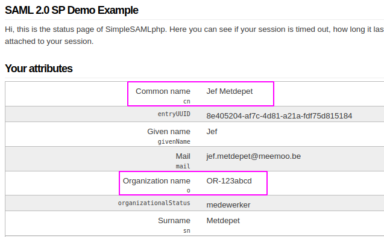

<details markdown="block">
  <summary>
    Inhoudstafel
  </summary>
  {: .text-delta }
1. TOC
{:toc}
</details>


# Introductie

Deze pagina beschrijft hoe een meemoo-SIP aan te leveren via S3.

# Voorvereisten

* Je hebt het voortraject gevolgd (zie: [https://support.meemoo.be/hc/nl/articles/8341026782365](https://support.meemoo.be/hc/nl/articles/8341026782365))
* Je kan meemoo-SIPs maken (zie: [docs/diginstroom/sip/]({{ site.baseurl }}))
* Je hebt een S3-bucket aangevraagd via [support@meemoo.be](mailto:support@meemoo.be).

# S3-token aanvragen

Met je meemoo-account kan je een S3-token aanvragen. Hiervoor heb je nodig

* je "_common name_": dit is jouw naam zoals die in [LDAP](https://nl.wikipedia.org/wiki/Lightweight_Directory_Access_Protocol) is gekend,
* het paswoord van jouw account,
* een vrij te kiezen _secret_ (een combinatie van letters, cijfers en tekens dat verschilt van je paswoord) die je zal gebruiken samen met je S3-token,
* de [OR-id](https://support.meemoo.be/hc/nl/articles/6089958726673-Communicatie-over-mijn-organisatie#hoe-vermeldt-meemoo-mijn-organisatienaam-op-interne-en-externe-platformen) van de organisatie waartoe je behoort.

Je "_common name_" is doorgaans gewoon je voornaam en je familienaam. Om zeker te zijn van de schrijfwijze kan je dit verifiëren via de meemoo-IDP (_Identity Provider_). Ook de OR-id van jouw organisatie kan je daar vinden. De IDP – afhankelijk van de omgeving – beschikbaar op volgende URL's:

<table >
  <colgroup>
    <col style="width: 15%;">
    <col style="width: 85%;">
  </colgroup>
  <tbody>
    <tr>
      <th>
        <p style="text-align: center;"><strong>INT</strong></p>
      </th>
      <td>
        <p>https://hetarchief-idp-int.do.viaa.be/module.php/core/authenticate.php?as=idp</p>
      </td>
    </tr>
    <tr>
      <th>
        <p style="text-align: center;"><strong>QAS</strong></p>
      </th>
      <td>
        <p>https://idp-qas.hetarchief.be/module.php/core/authenticate.php?as=idp</p>
      </td>
    </tr>
    <tr>
      <th>
        <p style="text-align: center;"><strong>PRD</strong></p>
      </th>
      <td>
        <p>https://idp.hetarchief.be/module.php/core/authenticate.php?as=idp</p>
      </td>
    </tr>
  </tbody>
</table>

<figure class="mx-auto">
   
  <figcaption>Je SAML-attributen in de IDP.</figcaption>
</figure>

De gebruikersnaam waarmee je een S3-token aanvraagt is: `common name+or-id`. In bovenstaand geval, bv:

```
Jef Metdepet+or-123abcd
```

{: .important }
**Let op**: zet het `or`\-gedeelte van je OR-id om in kleine letters! `OR-123abcd` moet dus `or-123abcd` worden.

Een token vraag je aan via een POST-call naar het token-endpoint per omgeving:

<table >
  <colgroup>
    <col style="width: 15%;">
    <col style="width: 85%;">
  </colgroup>
  <tbody>
    <tr>
      <th>
        <p style="text-align: center;"><strong>INT</strong></p>
      </th>
      <td>
        <p>https://s3-int.do.viaa.be/_admin/manage/tenants/&lt;tenant&gt;/tokens</p>
      </td>
    </tr>
    <tr>
      <th>
        <p style="text-align: center;"><strong>QAS</strong></p>
      </th>
      <td>
        <p>https://s3-qas.viaa.be/_admin/manage/tenants/&lt;tenant&gt;/tokens</p>
      </td>
    </tr>
    <tr>
      <th>
        <p style="text-align: center;"><strong>PRD</strong></p>
      </th>
      <td>
        <p>https://s3.viaa.be/_admin/manage/tenants/&lt;tenant&gt;/tokens</p>
      </td>
    </tr>
  </tbody>
</table>

{: .important }
**Let op**: de INT-omgeving is niet publiek bereikbaar! Wens je hiervoor een token aan te vragen, neem dan contact op met meemoo via [support@meemoo.be](mailto:support@meemoo.be).

Om voor een gebruiker een token aan te vragen, voer je een POST-call uit met de nodige metadata als headers naar het endpoint van de omgeving waarvoor je een token wil aanvragen.

Een token aanvragen voor de QAS-omgeving zou er dan zo uitzien:

```bash
curl -X POST \
    -H "X-User-Secret-Key-Meta: MyS3Secret" \
    -H "X-User-Token-Expires-Meta: +10" \
    -u "Jef Metdepet+or-123abcd" https://s3-qas.viaa.be/_admin/manage/tenants/OR-123abcd/tokens
```

Waarbij de headers volgende betekenis hebben:

*   `X-User-Secret-Key-Meta`: dit is het vrij te kiezen _secret_ waarmee je samen met de token zult authenticeren (dit is dus verschillend van het paswoord dat je gebruikt om in te loggen).
*   `X-User-Token-Expires-Meta`: dit is de levensduur van je token, uitgedrukt in dagen. Het is een goed idee deze levensduur zo kort mogelijk te zetten.
*   Je gebruikt de gebruikersnaam zoals hierboven vermeld (`Jef Metdepet+or-123abcd`).
*   In het endpoint gebruik je als `<tenant>` de OR-id van jouw organisatie (hier met `OR` in hoofdletters!).


Vervolgens wordt er naar je paswoord gevraagd. Daarna krijg je een token terug in de volgende vorm:

```json
{
  "token": "8b89d382891a33f8f05f875c7086f1f3",
  "owner": "Jef Metdepet",
  "scope": "+or-123abcd",
  "expiration": "2024-01-10T12:39:08.877Z",
  "creation": "2024-01-05T12:39:08.000Z",
  "secret": "MyS3Secret"
}
```

Met deze `token` en `secret` kan je nu verbinden met de S3-server en SIP's uploaden. Voor meer info over het werken met S3 of het opzetten van een integratie met S3, zie: [https://docs.aws.amazon.com/s3/index.html](https://docs.aws.amazon.com/s3/index.html).

**Opgelet**

Je moet altijd het meemoo-specifieke S3-endpoint configureren in je integratie of meegeven bij elke operatie. Dit zijn:

*   **INT**: `s3-int.do.viaa.be`
*   **QAS**: `s3-qas.viaa.be`
*   **PRD**: `s3.viaa.be`