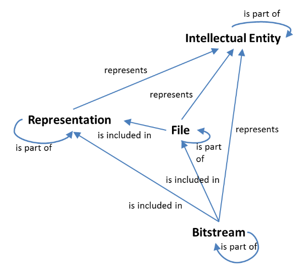

<details markdown="block">
   <summary>
      Index
   </summary>
   {: .text-delta }
   1. TOC
   {:toc}
</details>


# Abstract

The meemoo Submission Information Package (henceforth SIP) specification describes how data and metadata should be packaged when delivered to meemoo for ingest.
It can be used to create SIPs consisting of a single media file and accompanying metadata files.
Furthermore, it serves as a generic base for content-specific subprofiles for the ingest of specific use-cases (e.g. newspapers, 3D objects etc.).

# Introduction

Digital collections contain a wealth of content and information stored in various types of digital file formats accompanied by metadata defined in a variety of standards.
This poses a challenge for digital archives seeking a scalable way to ingest and disseminate an ever-growing number of digital objects.
As a digital archive for over 160 content partners, we at meemoo encounter this challenge on a daily basis.  
This has led to the development of the current SIP specification, in an attempt to standardize the delivery of (media) content and metadata by meemoo's content partners.

In this introduction we include a high-level conformance section of standards and requirements for implementers.
This is followed by a section of terminology definitions and a section about the data types in the meemoo SIP.
In the final section we introduce a fictional use-case of meemoo's SIP specification that we will use as a running example throughout the text.

## Instructions for reading this specification

Except sections explicitly marked as non-normative, all guidelines, examples and notes in this specification are to be considered normative.

The key words "MUST", "MUST NOT", "REQUIRED", "SHALL", "SHALL NOT", "SHOULD", "SHOULD NOT", "RECOMMENDED", "MAY", and "OPTIONAL" in this document are to be interpreted as described in [RFC 2119](https://tools.ietf.org/html/rfc2119).

This specification adheres to a number of standards and metadata schemas:

|Standards/schemas|Abbreviation|
|  ---  |  ---  |
|[BagIt File Packaging Format](https://www.rfc-editor.org/rfc/rfc8493.html)|BagIt|
|[E-ARK Common Specification for Information Packages](https://earkcsip.dilcis.eu/)|E-ARK CSIP|
|[E-ARK Specification for Submission Information Packages](https://earksip.dilcis.eu/)|E-ARK SIP|
|[Metadata Encoding & Transmission Standard](https://www.loc.gov/standards/mets/mets.xsd)|METS|
|[Dublin Core Metadata Initiative Metadata Terms](http://dublincore.org/schemas/xmls/qdc/2008/02/11/dcterms.xsd)|DC|
|[PREMIS for Preservation Metadata](https://www.loc.gov/standards/premis/v3/premis-v3-0.xsd)|PREMIS|

## Data Types

<mark>TO DO: paragraaf vertaling naar XML met attributen `xsi:type`; URI-kolom</mark>

Datatype                  |Definition                                                                                                             |
--------------------------|------------------------------------------------------------------------------------------------------------------------|
 EDTF      |Date and time, according to [Extended Date Time Format](https://www.loc.gov/standards/datetime/) (EDTF) level 0 and 1   |
 uuid                     |Universally Unique Identifier generated using random numbers;  subtype of String datatype                               |
 URI                      |Absolute or relative URIs and IRIs                                                                                      |
 Integer                  |Arbitrary-size integer numbers                                                                                          |
 String                   |Character strings                                                                                                       |

## Terminology

<mark>TO DO</mark>

| Term                	| Explanation 	|
|---------------------	|-------------	|
| bag                   |              |
| content               |              |
| content profile       |              |
| object              	|             	|
| simple object       	|             	|
| sidecar             	|             	|
| essence             	|             	|
| OAIS                	|             	|
| intellectual entity 	|             	|
| package               |              |
| SIP                 	|             	|
| DIP                 	|             	|
| AIP                 	|             	|


## Running example

<mark>to do:verschil informatief en normatief</mark>

One of meemoo's content partners, the (fictional) Flemish Cat Museum (henceforth FCM), wishes to archive a rare digitised picture of the Felis Catus Flamens (an extinct cat species originating in Flanders).
Besides the picture, the FCM owns a small set of descriptive metadata about the Felis Catus Flamens.

# meemoo SIP core concepts

This section covers a number of theoretical concepts in meemoo's SIP specification which return throughout the remainder of this text.
The first section defines the PREMIS concept of an intellectual entity and its relation to the so-called representation consisting of a number of files.
The second section zooms in on the directory structure of meemoo's SIP and how it reflects the distinction between an intellectual entity, its representations and the actual files making up those representations.

## Intellectual entities, representations and files

One of the underlying ideas in this specification, is the notion of an intellectual entity (henceforth IE) consisting of one of more (digital) representations which, in turn, consist of a set of files.
The [PREMIS Data Dictionary for Preservation Metadata](https://www.loc.gov/standards/premis/v3/premis-3-0-final.pdf) defines an IE as 'a distinct intellectual or artistic creation that is considered to be relevant to a designated community in the context of digital preservation'.
Each IE may have one or more (digital) representations, defined by PREMIS as 'a set of files (including metadata) needed for a complete rendition of an intellectual entity'.
It is up to the content partner to decide what is viewed as an intellectual entity, of how many representations it is made up and of which files each representation consists.

<center>

| |
|:---:|
| *PREMIS Object Diagram* |

</center>

## Metadata in meemoo's SIP

The metadata in meemoo's SIP can be divided into 4 categories: administrative, structural, descriptive and preservation metadata.

The three-way distinction between an IE, a representation and a digital file allows for a flexible way to include descriptive and preservation metadata.
It makes it possible to separate metadata about the content represented in a digital reproduction, from metadata purely about the digital reprodution itself.

Consider the example of a digitised newspaper edition with 10 pages.
Each page is digitised separately as a TIFF file and a JPEG file, resulting in 20 digital reproductions.
In this example we view the newspaper edition as a whole as the IE.
We can then discern between two representations of the newspaper: a high-resolution representation for e.g. high-resolution reproduction, and a JPEG representation for e.g. low-resolution browse copies on the web.
We can add descriptive metadata about both the newspaper edition (the IE) and the digital representations (the digital files contained in the TIFF and JPEG representations).

## Hierarchical directory structure

The meemoo SIP consists of a hierarchical directory structure with 3 levels:

- the root directory (henceforth bag-level);
- the data directory (henceforth package-level);
- the representations directory (henceforth representation-level).

Every level contains (meta)data about the IE of a SIP, but each level serves a specific purpose or describes a specfic (sub)set of the IE.

The bag-level contains information for integrity checking in a manifest file listing every file in the SIP together with its checksum.
The package-level 

bag-level contains information for integrity checking, package-level contains metadata about the intellectual entity and preservation metadata about the SIP itself, representation-level contains different representations, each containing a different digital representation of the intellectual entity along with the preservation and descriptive metadata of the digital representation.

Nut/gebruik van de 3 levels; welke info zit er op welk niveau;

**_Example_**

```diff
root_directory
│   manifest-md5.txt
│   bagit.txt
│
└──data
   │   mets.xml
   │
   └──metadata
   │  │
   │  └──descriptive
   │  │      ...
   │  │
   │  └──preservation
   │         ... 
   │
   └──representations
      │
      └──representation_1
      │  │   mets.xml
      │  │
      │  └──data
      │  │      ...
      │  │
      │  └──metadata
      │     │
      │     └──descriptive
      │     │      ...
      │     │
      │     └──preservation
      │            ...
      │
      └──representation_n
         │   ...
```

# Structure of a meemoo SIP

In this section we dissect meemoo's SIP package and discuss its requirements.
We follow the hierarchical folder structure discussed in XX and traverse the different levels of the SIP.
<mark>verplaatsen naar boven</mark>Where possible, we include tables with the metadata elements, their attributes and the level of requirements.
Further requirements are captured in plain text, using the [RFC 2119](https://tools.ietf.org/html/rfc2119) vocabulary.

## Structure of a meemoo SIP: bag-level

A bag is a compressed directory that serves as a wrapper around a SIP submitted by a CP for ingest in the meemoo archive.
It conforms to the BagIt 1.0 specification ([RFC 8493](https://www.rfc-editor.org/rfc/rfc8493.html)).
A bag only has a practical purpose as a transfer container between a CP's archive and meemoo's ingest space.
The bag will be unpacked during ingest and will be deleted after processing.
As such it will not appear in the meemoo archive as a separate entity.

**_Requirements_**

- A bag MUST be a compressed archive file.
- A bag MUST contain a _bagit.txt_ file.
- A bag MUST contain a _manifest-md5.txt_ file.
- A bag MUST contain content from only one particular CP and MUST NOT contain content from different CPs.
- A bag MUST contain a _/data_ directory.
- The contents of a bag MUST be character-encoded according to UTF-8.
- A bag SHOULD be a ZIP or TAR file.
- A bag MAY contain a _bag-info.txt_ file.

**_Example_**

```diff
root_directory
│   manifest-md5.txt
│   bagit.txt
│
└──data
   │   ...
```

### manifest-md5.txt (file)

The _manifest-md5.txt_ file lists all files in the bag across the different directories together with their corresponding checksums created with the MD5 message-digest algorithm.
It is used during processing of the bag to allow for data integrity checking.

**_Requirements_**

- The _manifest-md5.txt_ file MUST list all files contained in the bag.
- The _manifest-md5.txt_ file MUST NOT list any directories.
- The _manifest-md5.txt_ file MUST NOT list any files outside of the bag.
- Each line of the _manifest-md5.txt_ file MUST be of the form _checksum filepath_, where _filepath_ is the pathname of a file relative to the bag-lelvel directory, and _checksum_ is a hex-encoded checksum calculated by the MD5 message-digest algorithm.
- The slash ('/') character MUST be used as a path separator in _filepath_.
- One or more linear whitespace characters (spaces or tabs) MUST separate each _checksum_ from each _filepath_.
- Each line of the _manifest-md5.txt_ file MUST be terminated with an LF, a CR or a CRLF.

**_Example_**

```txt
95d9ac203e0690b8e03fc087c5c68479  ./data/mets.xml
1eb7ddc7c89c0855249afe8f0fd5e52a  ./data/representations/representation_1/mets.xml
7e50bacc8fecabcb5a14cc6bdc080ca2  ./data/representations/representation_1/data/AWH12931330.tif
49abb190b55d159adcd8ebc5dd73804b  ./data/representations/representation_1/metadata/preservation/AWH12931330.xml
87433f675bcd1125819afa1f0968943e  ./data/representations/representation_1/metadata/descriptive/AWH12931330.xml
eaa2c609ff6371712f623f5531945b44  ./bagit.txt
3399c34bd1871445705fd0921e5f32d8  ./manifest-md5.txt
```

### bagit.txt (file)

The _bagit.txt_ file contains exactly two lines in the exact order specified in the example below.
The first line specifies to which version of the BagIt specification ([RFC 8493](https://www.rfc-editor.org/rfc/rfc8493.html)) the bag conforms, while the second line identifies the character set encoding of the bag and its files.

**_Requirements_**

- The first line of the _bagit.txt_ file MUST specify the exact version of the BagIt standard.
- The second line of the _bagit.txt_ file MUST specify the character set encoding of the bag and its files.

**_Example_**

```txt
BagIt-Version: 1.0
Tag-File-Character-Encoding: UTF-8
```

### /data (directory)

The _/data_ directory contains the content of the bag, i.e. the media file and its accompanying metadata files, divided across a number of different files and directories.
Each _/data_ directory contains a single so-called package, consisting of the combination of a _mets.xml_ file, a _/metadata_ directory and a _/representations_ directory.

**_Requirements_**

- The _/data_ directory MUST contain exactly one package.
- The _/data_ directory MUST contain exactly one _mets.xml_ file.
- The _/data_ directory MUST contain exactly one _/metadata_ directory.
- The _/data_ directory MUST contain exactly one _/representations_ directory.
- The _/data_ directory MAY contain exactly one _/documentation_ directory.
- The _/data_ directory MAY contain exactly one _/schemas_ directory.

**_Example_**

```diff
root_directory
│   ...
│
└──data
   │   mets.xml
   │
   └──metadata
   │      ...
   └──representations
   │      ...
```

## Structure of a meemoo SIP: package-level

_**Example**_

```diff
root_directory
│   ...
│
└──data
   │   mets.xml
   │
   └──metadata
   │  │
   │  └──descriptive
   │  │  |   ...
   │  │
   │  └──preservation
   │     |   ... 
   │
   └──representations
      │   ...
```

### mets.xml (file)

The [Metadata Encoding and Transmission Standard](https://www.loc.gov/standards/mets/mets-home.html) (henceforth METS) is a metadata standard for encoding descriptive, administrative and structural metadata.
In the case of the meemoo SIP, the _mets.xml_ file merely acts as an inventory of the files and directories.
Since it is situated at the package-level, it is also known as the package mets.

It should not be confused with the _mets.xml_ files situated in their respective representation folders (cf. infra).
It is important to note that the package _mets.xml_ file does not record the internal structure of the different representations in the __/representations__ directory.
It only references the different _mets.xml_ files contained in each __/representation_n__ directory (where __n__ is an integer indicating the number of different representations in the __/representation__ directory).
Each of the __mets.xml__ files at the representation-level references its own internal structure.

#### element mets

This is the root element of the package mets.
It contains a number of XML schema namespaces together with a number of attributes to uniquely identify the package mets and the type of data it lists.

<div class="tg-wrap"><table style="undefined;table-layout: fixed; width: 1517px"><colgroup><col style="width: 224.88333px"><col style="width: 357.88333px"><col style="width: 933.88333px"></colgroup><tbody><tr><td><b>Element/Attribute</b></td><td colspan="2"><b><code>mets</code></b></td></tr><tr><td></td><td>Name</td><td>METS root element</td></tr><tr><td></td><td>Description/Rationale</td><td>This is the root element of the package METS.<br>It contains a number of XML schema namespaces together with a number of attributes to uniquely identify the package mets and the type of data it lists.</td></tr><tr><td></td><td>Datatype</td><td>/</td></tr><tr><td></td><td>Repeatability</td><td>1..1</td></tr><tr><td></td><td>Obligation</td><td>MUST</td></tr><tr><td><b>Element/Attribute</b></td><td colspan="2"><b><code>mets/@OBJID</code></b></td></tr><tr><td></td><td>Name</td><td>Package identifier</td></tr><tr><td></td><td>Description/Rationale</td><td>This is a UUID identifier for the METS document. For the package METS, this MUST be the same UUID as the one used for the entire bag.</td></tr><tr><td></td><td>Datatype</td><td>UUID</td></tr><tr><td></td><td>Repeatability</td><td>1..1</td></tr><tr><td></td><td>Obligation</td><td>MUST</td></tr><tr><td><b>Element/Attribute</b></td><td colspan="2"><b><code>mets/@TYPE</code></b></td></tr><tr><td></td><td>Name</td><td>Content category</td></tr><tr><td></td><td>Description/Rationale</td><td>This attribute MUST be set to declare the category of the content held in the SIP.</td></tr><tr><td></td><td>Datatype</td><td>String; fixed vocabulary</td></tr><tr><td></td><td>Vocabulary</td><td>["Textual works - Print","Textual works - Digital","Textual works - Electronic Serials","Digital Musical Composition (score-based representations)","Photographs - Print","Photographs - Digital","Other Graphic Images - Print","Other Graphic Images - Digital","Audio - On Tangible Medium (digital or analog)","Audio - Media-independent (digital)","Motion Pictures – Digital and Physical Media","Video – File-based and Physical Media","Software","Datasets","Geospatial Data","Databases","Websites","Collection","Event","Interactive resource","Physical object","Service","Mixed","Other"]</td></tr><tr><td></td><td>Repeatability</td><td>1..1</td></tr><tr><td></td><td>Obligation</td><td>MUST</td></tr><tr><td><b>Element/Attribute</b></td><td colspan="2"><b><code>mets[@TYPE="OTHER"]/@csip:OTHERTYPE</code></b></td></tr><tr><td></td><td>Name</td><td>Other content category</td></tr><tr><td></td><td>Description/Rationale</td><td>When the <code>mets/@TYPE</code> attribute is set to "OTHER", the <code>mets/@csip:OTHERTYPE</code> attribute SHOULD be used to declare the content category of the package representation not contained in the fixed vocabulary of the <code>@TYPE</code> attribute.</td></tr><tr><td></td><td>Datatype</td><td>String</td></tr><tr><td></td><td>Repeatability</td><td>0..1</td></tr><tr><td></td><td>Obligation</td><td>SHOULD</td></tr><tr><td><b>Element/Attribute</b></td><td colspan="2"><b><code>mets/@csip:CONTENTINFORMATIONTYPE</code></b></td></tr><tr><td></td><td>Name</td><td>Content information type specification</td></tr><tr><td></td><td>Description/Rationale</td><td>This attribute is used to declare the Content Information Type Specification used when creating the SIP.</td></tr><tr><td></td><td>Datatype</td><td>String; fixed vocabulary</td></tr><tr><td></td><td>Vocabulary</td><td>["ERMS","SIARD1","SIARD2","SIARDDK","GeoData","citscarchival_v1_0","citserms_v2_1","citspremis_v1_0","citsehpj_v1_0",<br>"citsehcr_v1_0","citssiard_v1_0","citsgeospatial_v3_0","MIXED","OTHER"]</td></tr><tr><td></td><td>Repeatability</td><td>0..1</td></tr><tr><td></td><td>Obligation</td><td>SHOULD</td></tr><tr><td><b>Element/Attribute</b></td><td colspan="2"><b><code>mets[@csip:CONTENTINFORMATIONTYPE='OTHER']/@csip:OTHERCONTENTINFORMATIONTYPE</code></b></td></tr><tr><td></td><td>Name</td><td>Other content information type specification</td></tr><tr><td></td><td>Description/Rationale</td><td>When the <code>mets[@csip:CONTENTINFORMATIONTYPE]</code> attribute is set to "OTHER", the <code>mets/@csip:OTHERCONTENTINFORMATIONTYPE</code> attribute SHOULD be used to declare the content information type not contained in the fixed vocabulary of the <code>mets[@csip:CONTENTINFORMATIONTYPE]</code> attribute.</td></tr><tr><td></td><td>Datatype</td><td>String</td></tr><tr><td></td><td>Repeatability</td><td>0..1</td></tr><tr><td></td><td>Obligation</td><td>SHOULD</td></tr><tr><td><b>Element/Attribute</b></td><td colspan="2"><b><code>mets/@PROFILE</code></b></td></tr><tr><td></td><td>Name</td><td>METS profile</td></tr><tr><td></td><td>Description/Rationale</td><td>The URL of the E-ARK METS profile that the SIP conforms with.<br>This URL MUST be set to “https://earksip.dilcis.eu/profile/E-ARK-SIP.xml”.</td></tr><tr><td></td><td>Datatype</td><td>URL</td></tr><tr><td></td><td>Repeatability</td><td>1..1</td></tr><tr><td></td><td>Obligation</td><td>MUST</td></tr><tr><td><b>Element/Attribute</b></td><td colspan="2"><b><code>mets/@LABEL</code></b></td></tr><tr><td></td><td>Name</td><td>Package name</td></tr><tr><td></td><td>Description/Rationale</td><td>An optional short text describing the contents of the package.</td></tr><tr><td></td><td>Datatype</td><td>String</td></tr><tr><td></td><td>Repeatability</td><td>0..1</td></tr><tr><td></td><td>Obligation</td><td>MAY</td></tr></tbody></table></div>

**_Example_**

```xml
<mets:mets xmlns:mets="http://www.loc.gov/METS/"
           xmlns:csip="https://DILCIS.eu/XML/ METS/CSIPExtensionMETS" 
           xmlns:sip="https://DILCIS.eu/XML/METS/SIPExtensionMETS"
           xmlns:xsi="http://www.w3.org/2001/XMLSchema-instance" 
           xmlns:xlink="http://www.w3. org/1999/xlink" 
           OBJID="54c3a254-9c78-494d-a1f1-d07640989038"
           TYPE="OTHER" 
           csip:OTHERTYPE="Photographs – Digital" 
           PROFILE="https://earksip .dilcis.eu/profile/E-ARK-SIP.xml" 
           >

<...>...</...>

</mets:mets>
```

#### mets:metsHdr

<div class="tg-wrap"><table style="undefined;table-layout: fixed; width: 2054px"><colgroup><col style="width: 326.88333px"><col style="width: 518.88333px"><col style="width: 1207.88333px"></colgroup><tbody><tr><td><b>Element/Attribute</b></td><td colspan="2"><b><code>mets/metsHdr</code></b></td></tr><tr><td></td><td>Name</td><td>Package header</td></tr><tr><td></td><td>Description/Rationale</td><td>General element that contains descriptive information about the SIP.</td></tr><tr><td></td><td>Datatype</td><td>/</td></tr><tr><td></td><td>Repeatability</td><td>1..1</td></tr><tr><td></td><td>Obligation</td><td>MUST</td></tr><tr><td><b>Element/Attribute</b></td><td colspan="2"><b><code>mets/metsHdr/@CREATEDATE</code></b></td></tr><tr><td></td><td>Name</td><td>Package creation datetime</td></tr><tr><td></td><td>Description/Rationale</td><td>This attribute records the date and time the SIP was created.</td></tr><tr><td></td><td>Datatype</td><td>EDTF</td></tr><tr><td></td><td>Repeatability</td><td>1..1</td></tr><tr><td></td><td>Obligation</td><td>MUST</td></tr><tr><td><b>Element/Attribute</b></td><td colspan="2"><b><code>mets/metsHdr/@LASTMODDATE</code></b></td></tr><tr><td></td><td>Name</td><td>Package last modification datetime</td></tr><tr><td></td><td>Description/Rationale</td><td>In case the SIP was modified since its creation, this attribute records the date and time of that modification. This attribute MUST be present and filled in when the SIP has been modified since its creation datetime.</td></tr><tr><td></td><td>Datatype</td><td>EDTF</td></tr><tr><td></td><td>Repeatability</td><td>0..1</td></tr><tr><td></td><td>Obligation</td><td>SHOULD</td></tr><tr><td><b>Element/Attribute</b></td><td colspan="2"><b><code>mets/metsHdr/@RECORDSTATUS</code></b></td></tr><tr><td></td><td>Name</td><td>Package status</td></tr><tr><td></td><td>Description/Rationale</td><td>A way of indicating the status of the SIP and to instruct the archive on how to properly handle it. If not set, the expected value is "NEW".</td></tr><tr><td></td><td>Datatype</td><td>String; fixed vocabulary</td></tr><tr><td></td><td>Vocabulary</td><td>["NEW","SUPPLEMENT","REPLACEMENT","TEST","VERSION","DELETE","OTHER"]</td></tr><tr><td></td><td>Repeatability</td><td>0..1</td></tr><tr><td></td><td>Obligation</td><td>MAY</td></tr><tr><td><b>Element/Attribute</b></td><td colspan="2"><b><code>mets/metsHdr/@csip:OAISPACKAGETYPE</code></b></td></tr><tr><td></td><td>Name</td><td>OAIS Package type information</td></tr><tr><td></td><td>Description/Rationale</td><td>The value of <code>@csip:OAISPACKAGETYPE</code> MUST be set to "SIP".</td></tr><tr><td></td><td>Datatype</td><td>String</td></tr><tr><td></td><td>Repeatability</td><td>1..1</td></tr><tr><td></td><td>Obligation</td><td>MUST</td></tr><tr><td><b>Element/Attribute</b></td><td colspan="2"><b><code>mets/metsHdr/agent</code></b></td></tr><tr><td></td><td>Name</td><td>SIP creator software agent</td></tr><tr><td></td><td>Description/Rationale</td><td>A mandatory agent element records the software used to create the package.</td></tr><tr><td></td><td>Datatype</td><td>/</td></tr><tr><td></td><td>Repeatability</td><td>1..1</td></tr><tr><td></td><td>Obligation</td><td>MUST</td></tr><tr><td><b>Element/Attribute</b></td><td colspan="2"><b><code>mets/metsHdr/agent/@ROLE</code></b></td></tr><tr><td></td><td>Name</td><td>SIP creator software agent role</td></tr><tr><td></td><td>Description/Rationale</td><td>The role of the SIP creator software agent.<br>This value MUST be set to "CREATOR".</td></tr><tr><td></td><td>Datatype</td><td>String</td></tr><tr><td></td><td>Repeatability</td><td>1..1</td></tr><tr><td></td><td>Obligation</td><td>MUST</td></tr><tr><td><b>Element/Attribute</b></td><td colspan="2"><b><code>mets/metsHdr/agent/@TYPE</code></b></td></tr><tr><td></td><td>Name</td><td>SIP creator software agent type</td></tr><tr><td></td><td>Description/Rationale</td><td>The type of the SIP creator software agent.<br>This value MUST be set to "OTHER".</td></tr><tr><td></td><td>Datatype</td><td>String</td></tr><tr><td></td><td>Repeatability</td><td>1..1</td></tr><tr><td></td><td>Obligation</td><td>MUST</td></tr><tr><td><b>Element/Attribute</b></td><td colspan="2"><b><code>mets/metsHdr/agent/@OTHERTYPE</code></b></td></tr><tr><td></td><td>Name</td><td>SIP creator software agent other type</td></tr><tr><td></td><td>Description/Rationale</td><td>A specification of the type of the SIP creator software agent, indicating it being software.<br>This value MUST be set to "SOFTWARE".</td></tr><tr><td></td><td>Datatype</td><td>String</td></tr><tr><td></td><td>Repeatability</td><td>1..1</td></tr><tr><td></td><td>Obligation</td><td>MUST</td></tr><tr><td><b>Element/Attribute</b></td><td colspan="2"><b><code>mets/metsHdr/agent/name</code></b></td></tr><tr><td></td><td>Name</td><td>SIP creator software agent name</td></tr><tr><td></td><td>Description/Rationale</td><td>This element records the name of the software tool used to create the SIP.</td></tr><tr><td></td><td>Datatype</td><td>String</td></tr><tr><td></td><td>Repeatability</td><td>1..1</td></tr><tr><td></td><td>Obligation</td><td>MUST</td></tr><tr><td><b>Element/Attribute</b></td><td colspan="2"><b><code>mets/metsHdr/agent/note</code></b></td></tr><tr><td></td><td>Name</td><td>SIP creator software agent additional information</td></tr><tr><td></td><td>Description/Rationale</td><td>The mandatory note element records the version of the software tool used to create the IP.<br>It MUST have a <code>@csip:NOTETYPE='SOFTWARE VERSION'</code> attribute.</td></tr><tr><td></td><td>Datatype</td><td>String</td></tr><tr><td></td><td>Repeatability</td><td>1..1</td></tr><tr><td></td><td>Obligation</td><td>MUST</td></tr><tr><td><b>Element/Attribute</b></td><td colspan="2"><b><code>mets/metsHdr/agent/note[@csip:NOTETYPE='SOFTWARE VERSION']</code></b></td></tr><tr><td></td><td>Name</td><td>Classification of the SIP creator software agent additional information</td></tr><tr><td></td><td>Description/Rationale</td><td>The value of this attribute MUST be set to "SOFTWARE VERSION"</td></tr><tr><td></td><td>Datatype</td><td>String</td></tr><tr><td></td><td>Repeatability</td><td>1..1</td></tr><tr><td></td><td>Obligation</td><td>MUST</td></tr><tr><td><b>Element/Attribute</b></td><td colspan="2"><b><code>mets/metsHdr/agent</code></b></td></tr><tr><td></td><td>Name</td><td>Archival creator agent</td></tr><tr><td></td><td>Description/Rationale</td><td>A wrapper element that enables to encode the name of the organisation or person that originally created the data being transferred. This can be different from the organisation tasked with preparing and sending the SIP to the archive (cf. 'submitting agent' below).</td></tr><tr><td></td><td>Datatype</td><td>/</td></tr><tr><td></td><td>Repeatability</td><td>0..1</td></tr><tr><td></td><td>Obligation</td><td>MAY</td></tr><tr><td><b>Element/Attribute</b></td><td colspan="2"><b><code>mets/metsHdr/agent/@ROLE</code></b></td></tr><tr><td></td><td>Name</td><td>Archival creator agent role</td></tr><tr><td></td><td>Description/Rationale</td><td>The role of the person(s) or institution(s) responsible for the document/collection.<br>This value MUST be set to "CREATOR".</td></tr><tr><td></td><td>Datatype</td><td>String</td></tr><tr><td></td><td>Repeatability</td><td>1..1</td></tr><tr><td></td><td>Obligation</td><td>MUST</td></tr><tr><td><b>Element/Attribute</b></td><td colspan="2"><b><code>mets/metsHdr/agent/@TYPE</code></b></td></tr><tr><td></td><td>Name</td><td>Archival creator agent type</td></tr><tr><td></td><td>Description/Rationale</td><td>The type of the archival creator agent.</td></tr><tr><td></td><td>Datatype</td><td>String; fixed vocabulary</td></tr><tr><td></td><td>Vocabulary</td><td>["ORGANIZATION","INDIVIDUAL","OTHER"]</td></tr><tr><td></td><td>Repeatability</td><td>1..1</td></tr><tr><td></td><td>Obligation</td><td>MUST</td></tr><tr><td><b>Element/Attribute</b></td><td colspan="2"><b><code>mets/metsHdr/agent/name</code></b></td></tr><tr><td></td><td>Name</td><td>Archival creator agent name</td></tr><tr><td></td><td>Description/Rationale</td><td>The name of the organisation(s) that originally created the data being transferred.</td></tr><tr><td></td><td>Datatype</td><td>String</td></tr><tr><td></td><td>Repeatability</td><td>0..*</td></tr><tr><td></td><td>Obligation</td><td>MAY</td></tr><tr><td><b>Element/Attribute</b></td><td colspan="2"><b><code>mets/metsHdr/agent/note</code></b></td></tr><tr><td></td><td>Name</td><td>Archival creator agent additional information</td></tr><tr><td></td><td>Description/Rationale</td><td>The archival creator agent MAY have a note providing a unique identification code for the archival creator.</td></tr><tr><td></td><td>Datatype</td><td>OR-id</td></tr><tr><td></td><td>Repeatability</td><td>0..1</td></tr><tr><td></td><td>Obligation</td><td>MAY</td></tr><tr><td><b>Element/Attribute</b></td><td colspan="2"><b><code>mets/metsHdr/agent/note/@csip:NOTETYPE</code></b></td></tr><tr><td></td><td>Name</td><td>Classification of the archival creator agent additional information</td></tr><tr><td></td><td>Description/Rationale</td><td>The archival creator agent note MUST be set to “IDENTIFICATIONCODE”.</td></tr><tr><td></td><td>Datatype</td><td>String</td></tr><tr><td></td><td>Repeatability</td><td>1..1</td></tr><tr><td></td><td>Obligation</td><td>MUST</td></tr><tr><td><b>Element/Attribute</b></td><td colspan="2"><b><code>mets/metsHdr/agent</code></b></td></tr><tr><td></td><td>Name</td><td>Submitting agent</td></tr><tr><td></td><td>Description/Rationale</td><td>The name of the organisation or person submitting the package to the archive.</td></tr><tr><td></td><td>Datatype</td><td>/</td></tr><tr><td></td><td>Repeatability</td><td>1..1</td></tr><tr><td></td><td>Obligation</td><td>MUST</td></tr><tr><td><b>Element/Attribute</b></td><td colspan="2"><b><code>mets/metsHdr/agent/@ROLE</code></b></td></tr><tr><td></td><td>Name</td><td>Submitting agent role</td></tr><tr><td></td><td>Description/Rationale</td><td>The role of the person(s) or institution(s) responsible for creating and/or submitting the package.</td></tr><tr><td></td><td>Datatype</td><td>String; fixed vocabulary</td></tr><tr><td></td><td>Vocabulary</td><td>["ARCHIVIST","CREATOR","CUSTODIAN","DISSEMINATOR","EDITOR","IPOWNER","OTHER"]</td></tr><tr><td></td><td>Repeatability</td><td>1..1</td></tr><tr><td></td><td>Obligation</td><td>MUST</td></tr><tr><td><b>Element/Attribute</b></td><td colspan="2"><b><code>mets/metsHdr/agent/@TYPE</code></b></td></tr><tr><td></td><td>Name</td><td>Submitting agent type</td></tr><tr><td></td><td>Description/Rationale</td><td>The type of the submitting agent.</td></tr><tr><td></td><td>Datatype</td><td>String; fixed vocabulary</td></tr><tr><td></td><td>Vocabulary</td><td>["ORGANIZATION","INDIVIDUAL","OTHER"]</td></tr><tr><td></td><td>Repeatability</td><td>1..1</td></tr><tr><td></td><td>Obligation</td><td>MUST</td></tr><tr><td><b>Element/Attribute</b></td><td colspan="2"><b><code>mets/metsHdr/agent/name</code></b></td></tr><tr><td></td><td>Name</td><td>Submitting agent name</td></tr><tr><td></td><td>Description/Rationale</td><td>Name of the organization or individual submitting the SIP to the archive.</td></tr><tr><td></td><td>Datatype</td><td>String</td></tr><tr><td></td><td>Repeatability</td><td>1..1</td></tr><tr><td></td><td>Obligation</td><td>MAY</td></tr><tr><td><b>Element/Attribute</b></td><td colspan="2"><b><code>mets/metsHdr/agent/note</code></b></td></tr><tr><td></td><td>Name</td><td>Submitting agent additional information</td></tr><tr><td></td><td>Description/Rationale</td><td>The submitting agent MAY have a note providing a unique identification code for the submitter.</td></tr><tr><td></td><td>Datatype</td><td>OR-id</td></tr><tr><td></td><td>Repeatability</td><td>0..1</td></tr><tr><td></td><td>Obligation</td><td>MAY</td></tr><tr><td><b>Element/Attribute</b></td><td colspan="2"><b><code>mets/metsHdr/agent/note/@csip:NOTETYPE</code></b></td></tr><tr><td></td><td>Name</td><td>Classification of the submitting agent agent additional information</td></tr><tr><td></td><td>Description/Rationale</td><td>This submitting agent note attribute MUST be set to “IDENTIFICATIONCODE”.</td></tr><tr><td></td><td>Datatype</td><td>String</td></tr><tr><td></td><td>Repeatability</td><td>1..1</td></tr><tr><td></td><td>Obligation</td><td>MUST</td></tr><tr><td><b>Element/Attribute</b></td><td colspan="2"><b><code>mets/metsHdr/agent</code></b></td></tr><tr><td></td><td>Name</td><td>Contact person agent</td></tr><tr><td></td><td>Description/Rationale</td><td>Contact person for the submission of the SIP.</td></tr><tr><td></td><td>Datatype</td><td>/</td></tr><tr><td></td><td>Repeatability</td><td>0..*</td></tr><tr><td></td><td>Obligation</td><td>MAY</td></tr><tr><td><b>Element/Attribute</b></td><td colspan="2"><b><code>mets/metsHdr/agent/@ROLE</code></b></td></tr><tr><td></td><td>Name</td><td>Contact person agent role</td></tr><tr><td></td><td>Description/Rationale</td><td>The role of the contact person agent MUST be set to “CREATOR”.</td></tr><tr><td></td><td>Datatype</td><td>String</td></tr><tr><td></td><td>Repeatability</td><td>1..1</td></tr><tr><td></td><td>Obligation</td><td>MUST</td></tr><tr><td><b>Element/Attribute</b></td><td colspan="2"><b><code>mets/metsHdr/agent/@TYPE</code></b></td></tr><tr><td></td><td>Name</td><td>Contact person agent type</td></tr><tr><td></td><td>Description/Rationale</td><td>The type of the contact person agent MUST be set to "INDIVIDUAL".</td></tr><tr><td></td><td>Datatype</td><td>String</td></tr><tr><td></td><td>Repeatability</td><td>1..1</td></tr><tr><td></td><td>Obligation</td><td>MUST</td></tr><tr><td><b>Element/Attribute</b></td><td colspan="2"><b><code>mets/metsHdr/agent/name</code></b></td></tr><tr><td></td><td>Name</td><td>Contact person agent name</td></tr><tr><td></td><td>Description/Rationale</td><td>Name of the contact person.</td></tr><tr><td></td><td>Datatype</td><td>String</td></tr><tr><td></td><td>Repeatability</td><td>1..1</td></tr><tr><td></td><td>Obligation</td><td>MUST</td></tr><tr><td><b>Element/Attribute</b></td><td colspan="2"><b><code>mets/metsHdr/agent/note</code></b></td></tr><tr><td></td><td>Name</td><td>Contact person agent additional information</td></tr><tr><td></td><td>Description/Rationale</td><td>The contact person agent MAY have one or more note providing the actual contact information, such as an address, e-mail, telephone number...</td></tr><tr><td></td><td>Datatype</td><td>String</td></tr><tr><td></td><td>Repeatability</td><td>0..*</td></tr><tr><td></td><td>Obligation</td><td>MAY</td></tr><tr><td><b>Element/Attribute</b></td><td colspan="2"><b><code>mets/metsHdr/agent</code></b></td></tr><tr><td></td><td>Name</td><td>Preservation agent</td></tr><tr><td></td><td>Description/Rationale</td><td>The organisation or person that preserves the package.</td></tr><tr><td></td><td>Datatype</td><td>/</td></tr><tr><td></td><td>Repeatability</td><td>0..1</td></tr><tr><td></td><td>Obligation</td><td>MAY</td></tr><tr><td><b>Element/Attribute</b></td><td colspan="2"><b><code>mets/metsHdr/agent/@ROLE</code></b></td></tr><tr><td></td><td>Name</td><td>Preservation agent role</td></tr><tr><td></td><td>Description/Rationale</td><td>The role of the perservation agent MUST be set to “PRESERVATION”.</td></tr><tr><td></td><td>Datatype</td><td>String</td></tr><tr><td></td><td>Repeatability</td><td>1..1</td></tr><tr><td></td><td>Obligation</td><td>MUST</td></tr><tr><td><b>Element/Attribute</b></td><td colspan="2"><b><code>mets/metsHdr/agent/@TYPE</code></b></td></tr><tr><td></td><td>Name</td><td>Preservation agent type</td></tr><tr><td></td><td>Description/Rationale</td><td>The type of the contact person agent MUST be set to "ORGANIZATION".</td></tr><tr><td></td><td>Datatype</td><td>String</td></tr><tr><td></td><td>Repeatability</td><td>1..1</td></tr><tr><td></td><td>Obligation</td><td>MUST</td></tr><tr><td><b>Element/Attribute</b></td><td colspan="2"><b><code>mets/metsHdr/agent/name</code></b></td></tr><tr><td></td><td>Name</td><td>Preservation agent name</td></tr><tr><td></td><td>Description/Rationale</td><td>Name of the organisation preserving the SIP.</td></tr><tr><td></td><td>Datatype</td><td>String</td></tr><tr><td></td><td>Repeatability</td><td>1..1</td></tr><tr><td></td><td>Obligation</td><td>MAY</td></tr><tr><td><b>Element/Attribute</b></td><td colspan="2"><b><code>mets/metsHdr/agent/note</code></b></td></tr><tr><td></td><td>Name</td><td>Preservation agent additional information</td></tr><tr><td></td><td>Description/Rationale</td><td>The preservation agent MAY have one note providing a unique identification code for the preserver.</td></tr><tr><td></td><td>Datatype</td><td>String</td></tr><tr><td></td><td>Repeatability</td><td>0..1</td></tr><tr><td></td><td>Obligation</td><td>MAY</td></tr><tr><td><b>Element/Attribute</b></td><td colspan="2"><b><code>mets/metsHdr/agent/note/@csip:NOTETYPE</code></b></td></tr><tr><td></td><td>Name</td><td>Classification of the preservation agent additional information</td></tr><tr><td></td><td>Description/Rationale</td><td>This perservation agent note attribute MUST be set to “IDENTIFICATIONCODE”.</td></tr><tr><td></td><td>Datatype</td><td>String</td></tr><tr><td></td><td>Repeatability</td><td>1..1</td></tr><tr><td></td><td>Obligation</td><td>MUST</td></tr><tr><td><b>Element/Attribute</b></td><td colspan="2"><b><code>mets/metsHdr/altRecordID[@TYPE='SUBMISSIONAGREEMENT']</code></b></td></tr><tr><td></td><td>Name</td><td>Submission agreement</td></tr><tr><td></td><td>Description/Rationale</td><td>An optional reference to the submission agreement associated with the SIP.<br>When used, this attribute MUST be set to "SUBMISSIONAGREEMENT".</td></tr><tr><td></td><td>Datatype</td><td>URL</td></tr><tr><td></td><td>Repeatability</td><td>0..1</td></tr><tr><td></td><td>Obligation</td><td>MAY</td></tr><tr><td><b>Element/Attribute</b></td><td colspan="2"><b><code>mets/metsHdr/altRecordID[@TYPE='PREVIOUSSUBMISSIONAGREEMENT']</code></b></td></tr><tr><td></td><td>Name</td><td>Previous submission agreement</td></tr><tr><td></td><td>Description/Rationale</td><td>An optional reference to a previous submission agreement associated with the SIP.<br>When used, this attribute MUST be set to "PREVIOUSSUBMISSIONAGREEMENT".</td></tr><tr><td></td><td>Datatype</td><td>URL</td></tr><tr><td></td><td>Repeatability</td><td>0..*</td></tr><tr><td></td><td>Obligation</td><td>MAY</td></tr><tr><td><b>Element/Attribute</b></td><td colspan="2"><b><code>mets/metsHdr/altRecordID[@TYPE='REFERENCECODE']</code></b></td></tr><tr><td></td><td>Name</td><td>Archival reference code</td></tr><tr><td></td><td>Description/Rationale</td><td>An optional reference to indicate where in the archival hierarchy the package shall be placed in the archive.<br>When used, this attribute MUST be set to "REFERENCECODE".</td></tr><tr><td></td><td>Datatype</td><td>URL</td></tr><tr><td></td><td>Repeatability</td><td>0..1</td></tr><tr><td></td><td>Obligation</td><td>MAY</td></tr><tr><td><b>Element/Attribute</b></td><td colspan="2"><b><code>mets/metsHdr/altRecordID[@TYPE='PREVIOUSREFERENCECODE']</code></b></td></tr><tr><td></td><td>Name</td><td>Previous archival reference code</td></tr><tr><td></td><td>Description/Rationale</td><td>In cases where the SIP originates from other institutions maintaining a reference code structure, this element can be used to record these reference codes and therefore support the provenance of the package when a whole archival description is not submitted with the submission.<br>When used, this attribute MUST be set to "PREVIOUSREFERENCECODE".</td></tr><tr><td></td><td>Datatype</td><td>URL</td></tr><tr><td></td><td>Repeatability</td><td>0..*</td></tr><tr><td></td><td>Obligation</td><td>MAY</td></tr></tbody></table></div>

_**Example**_

```xml
<mets:metsHdr CREATEDATE="2021-08-18T21:54:15.014+02:00"
              csip:OAISPACKAGETYPE="SIP">
 
<mets:agent ROLE="SIP CREATOR" TYPE="OTHER" OTHERTYPE="SOFTWARE">
    <mets:name>meemoo SIP creator</mets:name>
    <mets:note csip:NOTETYPE="SOFTWARE VERSION">0.1.</mets:note>
</mets:agent>

<mets:agent ROLE="ARCHIVAL CREATOR" TYPE="ORGANIZATION">
    <mets:name>Plantentuin Meise</mets:name>
</mets:agent>

<mets:agent ROLE="SUBMITTING AGENT" TYPE="ORGANIZATION">
    <mets:name>Plantentuin Meise</mets:name>
</mets:agent>

</mets:metsHdr>
```

#### mets:dmdSec

<div class="tg-wrap"><table style="undefined;table-layout: fixed; width: 2414px"><colgroup><col style="width: 383.88333px"><col style="width: 609.88333px"><col style="width: 1419.88333px"></colgroup><tbody><tr><td><b>Element/Attribute</b></td><td colspan="2"><b><code>mets/dmdSec</code></b></td></tr><tr><td></td><td>Name</td><td>Descriptive metadata section</td></tr><tr><td></td><td>Description/Rationale</td><td></td></tr><tr><td></td><td>Datatype</td><td>/</td></tr><tr><td></td><td>Repeatability</td><td>0..n</td></tr><tr><td></td><td>Obligation</td><td>SHOULD</td></tr><tr><td><b>Element/Attribute</b></td><td colspan="2"><b><code>mets/dmdSec/@ID</code></b></td></tr><tr><td></td><td>Name</td><td>Descriptive metadata section identifier</td></tr><tr><td></td><td>Description/Rationale</td><td></td></tr><tr><td></td><td>Datatype</td><td>UUID</td></tr><tr><td></td><td>Repeatability</td><td>1..1</td></tr><tr><td></td><td>Obligation</td><td>MUST</td></tr><tr><td><b>Element/Attribute</b></td><td colspan="2"><b><code>mets/dmdSec/@CREATED</code></b></td></tr><tr><td></td><td>Name</td><td>Descriptive metadata creation datetime</td></tr><tr><td></td><td>Description/Rationale</td><td></td></tr><tr><td></td><td>Datatype</td><td>EDTF</td></tr><tr><td></td><td>Repeatability</td><td>1..1</td></tr><tr><td></td><td>Obligation</td><td>MUST</td></tr><tr><td><b>Element/Attribute</b></td><td colspan="2"><b><code>mets/dmdSec/@STATUS</code></b></td></tr><tr><td></td><td>Name</td><td>Status of the descriptive metadata</td></tr><tr><td></td><td>Description/Rationale</td><td></td></tr><tr><td></td><td>Datatype</td><td>String; fixed vocabulary</td></tr><tr><td></td><td>Vocabulary</td><td>["CURRENT","SUPERSEDED"]</td></tr><tr><td></td><td>Repeatability</td><td>0..1</td></tr><tr><td></td><td>Obligation</td><td>SHOULD</td></tr><tr><td><b>Element/Attribute</b></td><td colspan="2"><b><code>mets/dmdSec/mdRef</code></b></td></tr><tr><td></td><td>Name</td><td>Reference to the document with the descriptive metadata (if not embedded within METS)</td></tr><tr><td></td><td>Description/Rationale</td><td></td></tr><tr><td></td><td>Datatype</td><td></td></tr><tr><td></td><td>Repeatability</td><td>0..1</td></tr><tr><td></td><td>Obligation</td><td>SHOULD</td></tr><tr><td><b>Element/Attribute</b></td><td colspan="2"><b><code>mets/dmdSec/mdRef[@LOCTYPE='URL']</code></b></td></tr><tr><td></td><td>Name</td><td>Type of locator</td></tr><tr><td></td><td>Description/Rationale</td><td></td></tr><tr><td></td><td>Datatype</td><td>URL</td></tr><tr><td></td><td>Repeatability</td><td>1..1</td></tr><tr><td></td><td>Obligation</td><td>MUST</td></tr><tr><td><b>Element/Attribute</b></td><td colspan="2"><b><code>mets/dmdSec/mdRef[@xlink:type='simple']</code></b></td></tr><tr><td></td><td>Name</td><td>Type of link</td></tr><tr><td></td><td>Description/Rationale</td><td></td></tr><tr><td></td><td>Datatype</td><td>String; fixed vocabulary</td></tr><tr><td></td><td>Vocabulary</td><td><a href = "https://www.w3.org/TR/xlink11/#link-types" target = "_self">XML Linking Language (XLink) value list</a></td></tr><tr><td></td><td>Repeatability</td><td>1..1</td></tr><tr><td></td><td>Obligation</td><td>MUST</td></tr><tr><td><b>Element/Attribute</b></td><td colspan="2"><b><code>mets/dmdSec/mdRef/@xlink:href</code></b></td></tr><tr><td></td><td>Name</td><td>Resource location</td></tr><tr><td></td><td>Description/Rationale</td><td></td></tr><tr><td></td><td>Datatype</td><td>URL</td></tr><tr><td></td><td>Repeatability</td><td>1..1</td></tr><tr><td></td><td>Obligation</td><td>MUST</td></tr><tr><td><b>Element/Attribute</b></td><td colspan="2"><b><code>mets/dmdSec/mdRef/@MDTYPE</code></b></td></tr><tr><td></td><td>Name</td><td>Type of descriptive metadata</td></tr><tr><td></td><td>Description/Rationale</td><td></td></tr><tr><td></td><td>Datatype</td><td>String; fixed vocabulary</td></tr><tr><td></td><td>Vocabulary</td><td>["MARC","MODS","EAD","DC","NISOIMG","LC-AV","VRA","TEIHDR","DDI","FGDC","LOM","PREMIS","PREMIS:OBJECT","PREMIS:AGENT","PREMIS:RIGHTS","PREMIS:EVENT","TEXTMD","METSRIGHTS","ISO 19115:2003 NAP","EAC-CPF","LIDO","OTHER"]</td></tr><tr><td></td><td>Repeatability</td><td>1..1</td></tr><tr><td></td><td>Obligation</td><td>MUST</td></tr><tr><td><b>Element/Attribute</b></td><td colspan="2"><b><code>mets/dmdSec/mdRef/@MIMETYPE</code></b></td></tr><tr><td></td><td>Name</td><td>File mime type</td></tr><tr><td></td><td>Description/Rationale</td><td></td></tr><tr><td></td><td>Datatype</td><td>IANA mime type</td></tr><tr><td></td><td>Repeatability</td><td>1..1</td></tr><tr><td></td><td>Obligation</td><td>MUST</td></tr><tr><td><b>Element/Attribute</b></td><td colspan="2"><b><code>mets/dmdSec/mdRef/@SIZE</code></b></td></tr><tr><td></td><td>Name</td><td>File size</td></tr><tr><td></td><td>Description/Rationale</td><td></td></tr><tr><td></td><td>Datatype</td><td>Integer</td></tr><tr><td></td><td>Repeatability</td><td>1..1</td></tr><tr><td></td><td>Obligation</td><td>MUST</td></tr><tr><td><b>Element/Attribute</b></td><td colspan="2"><b><code>mets/dmdSec/mdRef/@CREATED</code></b></td></tr><tr><td></td><td>Name</td><td>File creation datetime</td></tr><tr><td></td><td>Description/Rationale</td><td></td></tr><tr><td></td><td>Datatype</td><td>EDTF</td></tr><tr><td></td><td>Repeatability</td><td>1..1</td></tr><tr><td></td><td>Obligation</td><td>MUST</td></tr><tr><td><b>Element/Attribute</b></td><td colspan="2"><b><code>mets/dmdSec/mdRef/@CHECKSUM</code></b></td></tr><tr><td></td><td>Name</td><td>File checksum</td></tr><tr><td></td><td>Description/Rationale</td><td></td></tr><tr><td></td><td>Datatype</td><td></td></tr><tr><td></td><td>Repeatability</td><td>1..1</td></tr><tr><td></td><td>Obligation</td><td>MUST</td></tr><tr><td><b>Element/Attribute</b></td><td colspan="2"><b><code>mets/dmdSec/mdRef/@CHECKSUMTYPE</code></b></td></tr><tr><td></td><td>Name</td><td>File checksum type</td></tr><tr><td></td><td>Description/Rationale</td><td></td></tr><tr><td></td><td>Datatype</td><td></td></tr><tr><td></td><td>Repeatability</td><td>1..1</td></tr><tr><td></td><td>Obligation</td><td>MUST</td></tr></tbody></table></div>

#### mets:amdSec

<div class="tg-wrap"><table style="undefined;table-layout: fixed; width: 2414px"><colgroup><col style="width: 383.88333px"><col style="width: 609.88333px"><col style="width: 1419.88333px"></colgroup><tbody><tr><td><b>Element/Attribute</b></td><td colspan="2"><b><code>mets/amdSec</code></b></td></tr><tr><td></td><td>Name</td><td>Administrative metadata section</td></tr><tr><td></td><td>Description/Rationale</td><td></td></tr><tr><td></td><td>Datatype</td><td>/</td></tr><tr><td></td><td>Repeatability</td><td>0..1</td></tr><tr><td></td><td>Obligation</td><td>SHOULD</td></tr><tr><td><b>Element/Attribute</b></td><td colspan="2"><b><code>mets/amdSec/digiprovMD</code></b></td></tr><tr><td></td><td>Name</td><td>Digital provenance metadata</td></tr><tr><td></td><td>Description/Rationale</td><td></td></tr><tr><td></td><td>Datatype</td><td>/</td></tr><tr><td></td><td>Repeatability</td><td>0..n</td></tr><tr><td></td><td>Obligation</td><td>SHOULD</td></tr><tr><td><b>Element/Attribute</b></td><td colspan="2"><b><code>mets/amdSec/digiprovMD/@ID</code></b></td></tr><tr><td></td><td>Name</td><td>Digital provenance metadata identifier</td></tr><tr><td></td><td>Description/Rationale</td><td></td></tr><tr><td></td><td>Datatype</td><td>UUID</td></tr><tr><td></td><td>Repeatability</td><td>1..1</td></tr><tr><td></td><td>Obligation</td><td>MUST</td></tr><tr><td><b>Element/Attribute</b></td><td colspan="2"><b><code>mets/amdSec/digiprovMD/@STATUS</code></b></td></tr><tr><td></td><td>Name</td><td>Status of the digital provenance metadata</td></tr><tr><td></td><td>Description/Rationale</td><td></td></tr><tr><td></td><td>Datatype</td><td></td></tr><tr><td></td><td>Repeatability</td><td>0..1</td></tr><tr><td></td><td>Obligation</td><td>SHOULD</td></tr><tr><td><b>Element/Attribute</b></td><td colspan="2"><b><code>mets/amdSec/digiprovMD/mdRef</code></b></td></tr><tr><td></td><td>Name</td><td>Reference to the document with the digital provenance metadata</td></tr><tr><td></td><td>Description/Rationale</td><td></td></tr><tr><td></td><td>Datatype</td><td></td></tr><tr><td></td><td>Repeatability</td><td>0..1</td></tr><tr><td></td><td>Obligation</td><td>SHOULD</td></tr><tr><td><b>Element/Attribute</b></td><td colspan="2"><b><code>mets/amdSec/digiprovMD/mdRef[@LOCTYPE='URL']</code></b></td></tr><tr><td></td><td>Name</td><td>Type of locator</td></tr><tr><td></td><td>Description/Rationale</td><td></td></tr><tr><td></td><td>Datatype</td><td></td></tr><tr><td></td><td>Repeatability</td><td>1..1</td></tr><tr><td></td><td>Obligation</td><td>MUST</td></tr><tr><td><b>Element/Attribute</b></td><td colspan="2"><b><code>mets/amdSec/digiprovMD/mdRef[@xlink:type='simple']</code></b></td></tr><tr><td></td><td>Name</td><td>Type of link</td></tr><tr><td></td><td>Description/Rationale</td><td></td></tr><tr><td></td><td>Datatype</td><td></td></tr><tr><td></td><td>Repeatability</td><td>1..1</td></tr><tr><td></td><td>Obligation</td><td>MUST</td></tr><tr><td><b>Element/Attribute</b></td><td colspan="2"><b><code>mets/amdSec/digiprovMD/mdRef/@xlink:href</code></b></td></tr><tr><td></td><td>Name</td><td>Resource location</td></tr><tr><td></td><td>Description/Rationale</td><td></td></tr><tr><td></td><td>Datatype</td><td></td></tr><tr><td></td><td>Repeatability</td><td>1..1</td></tr><tr><td></td><td>Obligation</td><td>MUST</td></tr><tr><td><b>Element/Attribute</b></td><td colspan="2"><b><code>mets/amdSec/digiprovMD/mdRef/@MDTYPE</code></b></td></tr><tr><td></td><td>Name</td><td>Type of metadata</td></tr><tr><td></td><td>Description/Rationale</td><td></td></tr><tr><td></td><td>Datatype</td><td></td></tr><tr><td></td><td>Repeatability</td><td>1..1</td></tr><tr><td></td><td>Obligation</td><td>MUST</td></tr><tr><td><b>Element/Attribute</b></td><td colspan="2"><b><code>mets/amdSec/digiprovMD/mdRef/@MIMETYPE</code></b></td></tr><tr><td></td><td>Name</td><td>File mime type</td></tr><tr><td></td><td>Description/Rationale</td><td></td></tr><tr><td></td><td>Datatype</td><td>IANA mime type</td></tr><tr><td></td><td>Repeatability</td><td>1..1</td></tr><tr><td></td><td>Obligation</td><td>MUST</td></tr><tr><td><b>Element/Attribute</b></td><td colspan="2"><b><code>mets/amdSec/digiprovMD/mdRef/@SIZE</code></b></td></tr><tr><td></td><td>Name</td><td>File size</td></tr><tr><td></td><td>Description/Rationale</td><td></td></tr><tr><td></td><td>Datatype</td><td>Integer</td></tr><tr><td></td><td>Repeatability</td><td>1..1</td></tr><tr><td></td><td>Obligation</td><td>MUST</td></tr><tr><td><b>Element/Attribute</b></td><td colspan="2"><b><code>mets/amdSec/digiprovMD/mdRef/@CREATED</code></b></td></tr><tr><td></td><td>Name</td><td>File creation datetime</td></tr><tr><td></td><td>Description/Rationale</td><td></td></tr><tr><td></td><td>Datatype</td><td>EDTF</td></tr><tr><td></td><td>Repeatability</td><td>1..1</td></tr><tr><td></td><td>Obligation</td><td>MUST</td></tr><tr><td><b>Element/Attribute</b></td><td colspan="2"><b><code>mets/amdSec/digiprovMD/mdRef/@CHECKSUM</code></b></td></tr><tr><td></td><td>Name</td><td>File checksum</td></tr><tr><td></td><td>Description/Rationale</td><td></td></tr><tr><td></td><td>Datatype</td><td></td></tr><tr><td></td><td>Repeatability</td><td>1..1</td></tr><tr><td></td><td>Obligation</td><td>MUST</td></tr><tr><td><b>Element/Attribute</b></td><td colspan="2"><b><code>mets/amdSec/digiprovMD/mdRef/@CHECKSUMTYPE</code></b></td></tr><tr><td></td><td>Name</td><td>File checksum type</td></tr><tr><td></td><td>Description/Rationale</td><td></td></tr><tr><td></td><td>Datatype</td><td></td></tr><tr><td></td><td>Repeatability</td><td>1..1</td></tr><tr><td></td><td>Obligation</td><td>MUST</td></tr><tr><td><b>Element/Attribute</b></td><td colspan="2"><b><code>mets/amdSec/rightsMD</code></b></td></tr><tr><td></td><td>Name</td><td>Rights metadata</td></tr><tr><td></td><td>Description/Rationale</td><td></td></tr><tr><td></td><td>Datatype</td><td>/</td></tr><tr><td></td><td>Repeatability</td><td>0..n</td></tr><tr><td></td><td>Obligation</td><td>MAY</td></tr><tr><td><b>Element/Attribute</b></td><td colspan="2"><b><code>mets/amdSec/rightsMD/@ID</code></b></td></tr><tr><td></td><td>Name</td><td>Rights metadata identifier</td></tr><tr><td></td><td>Description/Rationale</td><td></td></tr><tr><td></td><td>Datatype</td><td>UUID</td></tr><tr><td></td><td>Repeatability</td><td>1..1</td></tr><tr><td></td><td>Obligation</td><td>MUST</td></tr><tr><td><b>Element/Attribute</b></td><td colspan="2"><b><code>mets/amdSec/rightsMD/@STATUS</code></b></td></tr><tr><td></td><td>Name</td><td>Status of the rights metadata</td></tr><tr><td></td><td>Description/Rationale</td><td></td></tr><tr><td></td><td>Datatype</td><td></td></tr><tr><td></td><td>Repeatability</td><td>0..1</td></tr><tr><td></td><td>Obligation</td><td>SHOULD</td></tr><tr><td><b>Element/Attribute</b></td><td colspan="2"><b><code>mets/amdSec/rightsMD/mdRef</code></b></td></tr><tr><td></td><td>Name</td><td>Reference to the document with the rights metadata</td></tr><tr><td></td><td>Description/Rationale</td><td></td></tr><tr><td></td><td>Datatype</td><td></td></tr><tr><td></td><td>Repeatability</td><td>0..1</td></tr><tr><td></td><td>Obligation</td><td>SHOULD</td></tr><tr><td><b>Element/Attribute</b></td><td colspan="2"><b><code>mets/amdSec/rightsMD/mdRef[@LOCTYPE='URL']</code></b></td></tr><tr><td></td><td>Name</td><td>Type of locator</td></tr><tr><td></td><td>Description/Rationale</td><td></td></tr><tr><td></td><td>Datatype</td><td></td></tr><tr><td></td><td>Repeatability</td><td>1..1</td></tr><tr><td></td><td>Obligation</td><td>MUST</td></tr><tr><td><b>Element/Attribute</b></td><td colspan="2"><b><code>mets/amdSec/rightsMD/mdRef[@xlink:type='simple']</code></b></td></tr><tr><td></td><td>Name</td><td>Type of locator</td></tr><tr><td></td><td>Description/Rationale</td><td></td></tr><tr><td></td><td>Datatype</td><td></td></tr><tr><td></td><td>Repeatability</td><td>1..1</td></tr><tr><td></td><td>Obligation</td><td>MUST</td></tr><tr><td><b>Element/Attribute</b></td><td colspan="2"><b><code>mets/amdSec/rightsMD/mdRef/@xlink:href</code></b></td></tr><tr><td></td><td>Name</td><td>Resource location</td></tr><tr><td></td><td>Description/Rationale</td><td></td></tr><tr><td></td><td>Datatype</td><td></td></tr><tr><td></td><td>Repeatability</td><td>1..1</td></tr><tr><td></td><td>Obligation</td><td>MUST</td></tr><tr><td><b>Element/Attribute</b></td><td colspan="2"><b><code>mets/amdSec/rightsMD/mdRef/@MDTYPE</code></b></td></tr><tr><td></td><td>Name</td><td>Type of metadata</td></tr><tr><td></td><td>Description/Rationale</td><td></td></tr><tr><td></td><td>Datatype</td><td></td></tr><tr><td></td><td>Repeatability</td><td>1..1</td></tr><tr><td></td><td>Obligation</td><td>MUST</td></tr><tr><td><b>Element/Attribute</b></td><td colspan="2"><b><code>mets/amdSec/rightsMD/mdRef/@MIMETYPE</code></b></td></tr><tr><td></td><td>Name</td><td>File mime type</td></tr><tr><td></td><td>Description/Rationale</td><td></td></tr><tr><td></td><td>Datatype</td><td>IANA mime type</td></tr><tr><td></td><td>Repeatability</td><td>1..1</td></tr><tr><td></td><td>Obligation</td><td>MUST</td></tr><tr><td><b>Element/Attribute</b></td><td colspan="2"><b><code>mets/amdSec/rightsMD/mdRef/@SIZE</code></b></td></tr><tr><td></td><td>Name</td><td>File size</td></tr><tr><td></td><td>Description/Rationale</td><td></td></tr><tr><td></td><td>Datatype</td><td>Integer</td></tr><tr><td></td><td>Repeatability</td><td>1..1</td></tr><tr><td></td><td>Obligation</td><td>MUST</td></tr><tr><td><b>Element/Attribute</b></td><td colspan="2"><b><code>mets/amdSec/rightsMD/mdRef/@CREATED</code></b></td></tr><tr><td></td><td>Name</td><td>File creation datetime</td></tr><tr><td></td><td>Description/Rationale</td><td></td></tr><tr><td></td><td>Datatype</td><td>EDTF</td></tr><tr><td></td><td>Repeatability</td><td>1..1</td></tr><tr><td></td><td>Obligation</td><td>MUST</td></tr><tr><td><b>Element/Attribute</b></td><td colspan="2"><b><code>mets/amdSec/rightsMD/mdRef/@CHECKSUM</code></b></td></tr><tr><td></td><td>Name</td><td>File checksum</td></tr><tr><td></td><td>Description/Rationale</td><td></td></tr><tr><td></td><td>Datatype</td><td></td></tr><tr><td></td><td>Repeatability</td><td>1..1</td></tr><tr><td></td><td>Obligation</td><td>MUST</td></tr><tr><td><b>Element/Attribute</b></td><td colspan="2"><b><code>mets/amdSec/rightsMD/mdRef/@CHECKSUMTYPE</code></b></td></tr><tr><td></td><td>Name</td><td>File checksum type</td></tr><tr><td></td><td>Description/Rationale</td><td></td></tr><tr><td></td><td>Datatype</td><td></td></tr><tr><td></td><td>Repeatability</td><td>1..1</td></tr><tr><td></td><td>Obligation</td><td>MUST</td></tr></tbody></table></div>

#### mets:fileSec

<div class="tg-wrap"><table style="undefined;table-layout: fixed; width: 2414px"><colgroup><col style="width: 383.88333px"><col style="width: 609.88333px"><col style="width: 1419.88333px"></colgroup><tbody><tr><td><b>Element/Attribute</b></td><td colspan="2"><b><code>mets/fileSec</code></b></td></tr><tr><td></td><td>Name</td><td>mets/fileSec</td></tr><tr><td></td><td>Description/Rationale</td><td></td></tr><tr><td></td><td>Datatype</td><td>/</td></tr><tr><td></td><td>Repeatability</td><td>0..1</td></tr><tr><td></td><td>Obligation</td><td>SHOULD</td></tr><tr><td><b>Element/Attribute</b></td><td colspan="2"><b><code>mets/fileSec/@ID</code></b></td></tr><tr><td></td><td>Name</td><td>File section identifier</td></tr><tr><td></td><td>Description/Rationale</td><td></td></tr><tr><td></td><td>Datatype</td><td>UUID</td></tr><tr><td></td><td>Repeatability</td><td>1..1</td></tr><tr><td></td><td>Obligation</td><td>MUST</td></tr><tr><td><b>Element/Attribute</b></td><td colspan="2"><b><code>mets/fileSec/fileGrp[@USE='Documentation']</code></b></td></tr><tr><td></td><td>Name</td><td>Documentation file group</td></tr><tr><td></td><td>Description/Rationale</td><td></td></tr><tr><td></td><td>Datatype</td><td></td></tr><tr><td></td><td>Repeatability</td><td>1..n</td></tr><tr><td></td><td>Obligation</td><td>MUST</td></tr><tr><td><b>Element/Attribute</b></td><td colspan="2"><b><code>mets/fileSec/fileGrp[@USE='Schemas']</code></b></td></tr><tr><td></td><td>Name</td><td>Schema file group</td></tr><tr><td></td><td>Description/Rationale</td><td></td></tr><tr><td></td><td>Datatype</td><td></td></tr><tr><td></td><td>Repeatability</td><td>1..n</td></tr><tr><td></td><td>Obligation</td><td>MUST</td></tr><tr><td><b>Element/Attribute</b></td><td colspan="2"><b><code>mets/fileSec/fileGrp[@USE=[starts-with('Representations')]]</code></b></td></tr><tr><td></td><td>Name</td><td>Representations file group</td></tr><tr><td></td><td>Description/Rationale</td><td></td></tr><tr><td></td><td>Datatype</td><td></td></tr><tr><td></td><td>Repeatability</td><td>1..n</td></tr><tr><td></td><td>Obligation</td><td>MUST</td></tr><tr><td><b>Element/Attribute</b></td><td colspan="2"><b><code>mets/fileSec/fileGrp/@ADMID</code></b></td></tr><tr><td></td><td>Name</td><td>Reference to administrative metadata</td></tr><tr><td></td><td>Description/Rationale</td><td></td></tr><tr><td></td><td>Datatype</td><td>UUID</td></tr><tr><td></td><td>Repeatability</td><td>0..1</td></tr><tr><td></td><td>Obligation</td><td>MAY</td></tr><tr><td><b>Element/Attribute</b></td><td colspan="2"><b><code>mets/@csip:CONTENTINFORMATIONTYPE="MIXED"|mets/fileSec/fileGrp[@USE=[starts-with('Representations')]]/@csip:CONTENTINFORMATIONTYPE</code></b></td></tr><tr><td></td><td>Name</td><td>Content Information Type Specification</td></tr><tr><td></td><td>Description/Rationale</td><td></td></tr><tr><td></td><td>Datatype</td><td></td></tr><tr><td></td><td>Repeatability</td><td>0..1</td></tr><tr><td></td><td>Obligation</td><td>SHOULD</td></tr><tr><td><b>Element/Attribute</b></td><td colspan="2"><b><code>mets/fileSec/fileGrp[@csip:CONTENTINFORMATIONTYPE='OTHER']/@csip:OTHERCONTENTINFORMATIONTYPE</code></b></td></tr><tr><td></td><td>Name</td><td>Other Content Information Type Specification</td></tr><tr><td></td><td>Description/Rationale</td><td></td></tr><tr><td></td><td>Datatype</td><td></td></tr><tr><td></td><td>Repeatability</td><td>0..1</td></tr><tr><td></td><td>Obligation</td><td>MAY</td></tr><tr><td><b>Element/Attribute</b></td><td colspan="2"><b><code>mets/fileSec/fileGrp/@USE</code></b></td></tr><tr><td></td><td>Name</td><td>Description of the use of the file group</td></tr><tr><td></td><td>Description/Rationale</td><td></td></tr><tr><td></td><td>Datatype</td><td></td></tr><tr><td></td><td>Repeatability</td><td>1..1</td></tr><tr><td></td><td>Obligation</td><td>MUST</td></tr><tr><td><b>Element/Attribute</b></td><td colspan="2"><b><code>mets/fileSec/fileGrp/@ID</code></b></td></tr><tr><td></td><td>Name</td><td>File group identifier</td></tr><tr><td></td><td>Description/Rationale</td><td></td></tr><tr><td></td><td>Datatype</td><td>UUID</td></tr><tr><td></td><td>Repeatability</td><td>1..1</td></tr><tr><td></td><td>Obligation</td><td>MUST</td></tr><tr><td><b>Element/Attribute</b></td><td colspan="2"><b><code>mets/fileSec/fileGrp/file</code></b></td></tr><tr><td></td><td>Name</td><td>File</td></tr><tr><td></td><td>Description/Rationale</td><td></td></tr><tr><td></td><td>Datatype</td><td>/</td></tr><tr><td></td><td>Repeatability</td><td>1..n</td></tr><tr><td></td><td>Obligation</td><td>MUST</td></tr><tr><td><b>Element/Attribute</b></td><td colspan="2"><b><code>mets/fileSec/fileGrp/file/@ID</code></b></td></tr><tr><td></td><td>Name</td><td>File identifier</td></tr><tr><td></td><td>Description/Rationale</td><td></td></tr><tr><td></td><td>Datatype</td><td>UUID</td></tr><tr><td></td><td>Repeatability</td><td>1..1</td></tr><tr><td></td><td>Obligation</td><td>MUST</td></tr><tr><td><b>Element/Attribute</b></td><td colspan="2"><b><code>mets/fileSec/fileGrp/file/@MIMETYPE</code></b></td></tr><tr><td></td><td>Name</td><td>File mimetype</td></tr><tr><td></td><td>Description/Rationale</td><td></td></tr><tr><td></td><td>Datatype</td><td>IANA mime type</td></tr><tr><td></td><td>Repeatability</td><td>1..1</td></tr><tr><td></td><td>Obligation</td><td>MUST</td></tr><tr><td><b>Element/Attribute</b></td><td colspan="2"><b><code>mets/fileSec/fileGrp/file/@SIZE</code></b></td></tr><tr><td></td><td>Name</td><td>File size</td></tr><tr><td></td><td>Description/Rationale</td><td></td></tr><tr><td></td><td>Datatype</td><td>Integer</td></tr><tr><td></td><td>Repeatability</td><td>1..1</td></tr><tr><td></td><td>Obligation</td><td>MUST</td></tr><tr><td><b>Element/Attribute</b></td><td colspan="2"><b><code>mets/fileSec/fileGrp/file/@CREATED</code></b></td></tr><tr><td></td><td>Name</td><td>File creation datetime</td></tr><tr><td></td><td>Description/Rationale</td><td></td></tr><tr><td></td><td>Datatype</td><td>EDTF</td></tr><tr><td></td><td>Repeatability</td><td>1..1</td></tr><tr><td></td><td>Obligation</td><td>MUST</td></tr><tr><td><b>Element/Attribute</b></td><td colspan="2"><b><code>mets/fileSec/fileGrp/file/@CHECKSUM</code></b></td></tr><tr><td></td><td>Name</td><td>File checksum</td></tr><tr><td></td><td>Description/Rationale</td><td></td></tr><tr><td></td><td>Datatype</td><td></td></tr><tr><td></td><td>Repeatability</td><td>1..1</td></tr><tr><td></td><td>Obligation</td><td>MUST</td></tr><tr><td><b>Element/Attribute</b></td><td colspan="2"><b><code>mets/fileSec/fileGrp/file/@CHECKSUMTYPE</code></b></td></tr><tr><td></td><td>Name</td><td>File checksum type</td></tr><tr><td></td><td>Description/Rationale</td><td></td></tr><tr><td></td><td>Datatype</td><td></td></tr><tr><td></td><td>Repeatability</td><td>1..1</td></tr><tr><td></td><td>Obligation</td><td>MUST</td></tr><tr><td><b>Element/Attribute</b></td><td colspan="2"><b><code>mets/fileSec/fileGrp/file/@OWNERID</code></b></td></tr><tr><td></td><td>Name</td><td>File original identification</td></tr><tr><td></td><td>Description/Rationale</td><td></td></tr><tr><td></td><td>Datatype</td><td></td></tr><tr><td></td><td>Repeatability</td><td>0..1</td></tr><tr><td></td><td>Obligation</td><td>MAY</td></tr><tr><td><b>Element/Attribute</b></td><td colspan="2"><b><code>mets/fileSec/fileGrp/file/@ADMID</code></b></td></tr><tr><td></td><td>Name</td><td>File reference to administrative metadata</td></tr><tr><td></td><td>Description/Rationale</td><td></td></tr><tr><td></td><td>Datatype</td><td>UUID</td></tr><tr><td></td><td>Repeatability</td><td>0..1</td></tr><tr><td></td><td>Obligation</td><td>MAY</td></tr><tr><td><b>Element/Attribute</b></td><td colspan="2"><b><code>mets/fileSec/fileGrp/file/@DMDID</code></b></td></tr><tr><td></td><td>Name</td><td>File reference to descriptive metadata</td></tr><tr><td></td><td>Description/Rationale</td><td></td></tr><tr><td></td><td>Datatype</td><td>UUID</td></tr><tr><td></td><td>Repeatability</td><td>0..1</td></tr><tr><td></td><td>Obligation</td><td>MAY</td></tr><tr><td><b>Element/Attribute</b></td><td colspan="2"><b><code>mets/fileSec/fileGrp/file/FLocat</code></b></td></tr><tr><td></td><td>Name</td><td>File locator reference</td></tr><tr><td></td><td>Description/Rationale</td><td></td></tr><tr><td></td><td>Datatype</td><td></td></tr><tr><td></td><td>Repeatability</td><td>1..1</td></tr><tr><td></td><td>Obligation</td><td>MUST</td></tr><tr><td><b>Element/Attribute</b></td><td colspan="2"><b><code>mets/fileSec/fileGrp/file/FLocat[@LOCTYPE='URL']</code></b></td></tr><tr><td></td><td>Name</td><td>Type of locator</td></tr><tr><td></td><td>Description/Rationale</td><td></td></tr><tr><td></td><td>Datatype</td><td></td></tr><tr><td></td><td>Repeatability</td><td>1..1</td></tr><tr><td></td><td>Obligation</td><td>MUST</td></tr><tr><td><b>Element/Attribute</b></td><td colspan="2"><b><code>mets/fileSec/fileGrp/file/FLocat[@xlink:type='simple']</code></b></td></tr><tr><td></td><td>Name</td><td>Type of link</td></tr><tr><td></td><td>Description/Rationale</td><td></td></tr><tr><td></td><td>Datatype</td><td></td></tr><tr><td></td><td>Repeatability</td><td>1..1</td></tr><tr><td></td><td>Obligation</td><td>MUST</td></tr><tr><td><b>Element/Attribute</b></td><td colspan="2"><b><code>mets/fileSec/fileGrp/file/FLocat/@xlink:href</code></b></td></tr><tr><td></td><td>Name</td><td>Resource location</td></tr><tr><td></td><td>Description/Rationale</td><td></td></tr><tr><td></td><td>Datatype</td><td></td></tr><tr><td></td><td>Repeatability</td><td>1..1</td></tr><tr><td></td><td>Obligation</td><td>MUST</td></tr></tbody></table></div>

_**Example**_

```xml
<mets:fileSec ID="71f7a408-dfb9-427c-b29c-ba7983408016">
    <mets:fileGrp USE="root" ID="19608ee9-53b0-4341-8e1c-33b410d64e30">
        <mets:fileGrp USE="metadata" ID="1ab8905c-ff79-48a1-8c4d-9e306fdab4ba">
            <mets:fileGrp USE="descriptive" ID="983c5556-56bf-42b9-a547-4f8b510429dc"/>
            <mets:fileGrp USE="preservation" ID="aa12de3c-7648-4476-9dde-f7a899fb2f13"/>
        </mets:fileGrp>
        <mets:fileGrp USE="representations" ID="83de5a57-53ff-483f-8791-22dc32e29cdb"/>
    </mets:fileGrp>
</mets:fileSec>
```

#### mets:structMap

<div class="tg-wrap"><table style="undefined;table-layout: fixed; width: 2414px"><colgroup><col style="width: 383.88333px"><col style="width: 609.88333px"><col style="width: 1419.88333px"></colgroup><tbody><tr><td><b>Element/Attribute</b></td><td colspan="2"><b><code>mets/structMap</code></b></td></tr><tr><td></td><td>Name</td><td>Structural description of the package</td></tr><tr><td></td><td>Description/Rationale</td><td></td></tr><tr><td></td><td>Datatype</td><td>/</td></tr><tr><td></td><td>Repeatability</td><td>1..*</td></tr><tr><td></td><td>Obligation</td><td>MUST</td></tr><tr><td><b>Element/Attribute</b></td><td colspan="2"><b><code>mets/structMap[@TYPE='PHYSICAL']</code></b></td></tr><tr><td></td><td>Name</td><td>Type of structural description</td></tr><tr><td></td><td>Description/Rationale</td><td></td></tr><tr><td></td><td>Datatype</td><td></td></tr><tr><td></td><td>Repeatability</td><td>1..1</td></tr><tr><td></td><td>Obligation</td><td>MUST</td></tr><tr><td><b>Element/Attribute</b></td><td colspan="2"><b><code>mets/structMap[@LABEL='CSIP']</code></b></td></tr><tr><td></td><td>Name</td><td>Name of the structural description</td></tr><tr><td></td><td>Description/Rationale</td><td></td></tr><tr><td></td><td>Datatype</td><td></td></tr><tr><td></td><td>Repeatability</td><td>1..1</td></tr><tr><td></td><td>Obligation</td><td>MUST</td></tr><tr><td><b>Element/Attribute</b></td><td colspan="2"><b><code>mets/structMap[@LABEL='CSIP']/@ID</code></b></td></tr><tr><td></td><td>Name</td><td>Structural description identifier</td></tr><tr><td></td><td>Description/Rationale</td><td></td></tr><tr><td></td><td>Datatype</td><td></td></tr><tr><td></td><td>Repeatability</td><td>1..1</td></tr><tr><td></td><td>Obligation</td><td>MUST</td></tr><tr><td><b>Element/Attribute</b></td><td colspan="2"><b><code>mets/structMap[@LABEL='CSIP']/div</code></b></td></tr><tr><td></td><td>Name</td><td>Main structural division</td></tr><tr><td></td><td>Description/Rationale</td><td></td></tr><tr><td></td><td>Datatype</td><td></td></tr><tr><td></td><td>Repeatability</td><td>1..1</td></tr><tr><td></td><td>Obligation</td><td>MUST</td></tr><tr><td><b>Element/Attribute</b></td><td colspan="2"><b><code>mets/structMap[@LABEL='CSIP']/div/@ID</code></b></td></tr><tr><td></td><td>Name</td><td>Main structural division identifier</td></tr><tr><td></td><td>Description/Rationale</td><td></td></tr><tr><td></td><td>Datatype</td><td></td></tr><tr><td></td><td>Repeatability</td><td>1..1</td></tr><tr><td></td><td>Obligation</td><td>MUST</td></tr><tr><td><b>Element/Attribute</b></td><td colspan="2"><b><code>mets/structMap[@LABEL='CSIP']/div/div[@LABEL='Metadata']</code></b></td></tr><tr><td></td><td>Name</td><td>Metadata division</td></tr><tr><td></td><td>Description/Rationale</td><td></td></tr><tr><td></td><td>Datatype</td><td></td></tr><tr><td></td><td>Repeatability</td><td>1..1</td></tr><tr><td></td><td>Obligation</td><td>MUST</td></tr><tr><td><b>Element/Attribute</b></td><td colspan="2"><b><code>mets/structMap[@LABEL='CSIP']/div/div[@LABEL='Metadata']/@ID</code></b></td></tr><tr><td></td><td>Name</td><td>Metadata division identifier</td></tr><tr><td></td><td>Description/Rationale</td><td></td></tr><tr><td></td><td>Datatype</td><td>UUID</td></tr><tr><td></td><td>Repeatability</td><td>1..1</td></tr><tr><td></td><td>Obligation</td><td>MUST</td></tr><tr><td><b>Element/Attribute</b></td><td colspan="2"><b><code>mets/structMap[@LABEL='CSIP']/div/div[@LABEL='Metadata']</code></b></td></tr><tr><td></td><td>Name</td><td>Metadata division label</td></tr><tr><td></td><td>Description/Rationale</td><td></td></tr><tr><td></td><td>Datatype</td><td></td></tr><tr><td></td><td>Repeatability</td><td>1..1</td></tr><tr><td></td><td>Obligation</td><td>MUST</td></tr><tr><td><b>Element/Attribute</b></td><td colspan="2"><b><code>mets/structMap[@LABEL='CSIP']/div/div[@LABEL='Metadata']/@ADMID</code></b></td></tr><tr><td></td><td>Name</td><td>Metadata division references administrative metadata</td></tr><tr><td></td><td>Description/Rationale</td><td></td></tr><tr><td></td><td>Datatype</td><td>UUID</td></tr><tr><td></td><td>Repeatability</td><td>0..1</td></tr><tr><td></td><td>Obligation</td><td>SHOULD</td></tr><tr><td><b>Element/Attribute</b></td><td colspan="2"><b><code>mets/structMap[@LABEL='CSIP']/div/div[@LABEL='Metadata']/@DMDID</code></b></td></tr><tr><td></td><td>Name</td><td>Metadata division references descriptive metadata</td></tr><tr><td></td><td>Description/Rationale</td><td></td></tr><tr><td></td><td>Datatype</td><td></td></tr><tr><td></td><td>Repeatability</td><td>0..1</td></tr><tr><td></td><td>Obligation</td><td>SHOULD</td></tr><tr><td><b>Element/Attribute</b></td><td colspan="2"><b><code>mets/structMap[@LABEL='CSIP']/div/div[@LABEL='Documentation']</code></b></td></tr><tr><td></td><td>Name</td><td>Documentation division</td></tr><tr><td></td><td>Description/Rationale</td><td></td></tr><tr><td></td><td>Datatype</td><td></td></tr><tr><td></td><td>Repeatability</td><td>0..1</td></tr><tr><td></td><td>Obligation</td><td>SHOULD</td></tr><tr><td><b>Element/Attribute</b></td><td colspan="2"><b><code>mets/structMap[@LABEL='CSIP']/div/div[@LABEL='Documentation']/@ID</code></b></td></tr><tr><td></td><td>Name</td><td>Documentation division identifier</td></tr><tr><td></td><td>Description/Rationale</td><td></td></tr><tr><td></td><td>Datatype</td><td></td></tr><tr><td></td><td>Repeatability</td><td>1..1</td></tr><tr><td></td><td>Obligation</td><td>MUST</td></tr><tr><td><b>Element/Attribute</b></td><td colspan="2"><b><code>mets/structMap[@LABEL='CSIP']/div/div[@LABEL='Documentation']</code></b></td></tr><tr><td></td><td>Name</td><td>Documentation division label</td></tr><tr><td></td><td>Description/Rationale</td><td></td></tr><tr><td></td><td>Datatype</td><td></td></tr><tr><td></td><td>Repeatability</td><td>1..1</td></tr><tr><td></td><td>Obligation</td><td>MUST</td></tr><tr><td><b>Element/Attribute</b></td><td colspan="2"><b><code>mets/structMap[@LABEL='CSIP']/div/div[@LABEL='Documentation']/fptr</code></b></td></tr><tr><td></td><td>Name</td><td>Documentation file references</td></tr><tr><td></td><td>Description/Rationale</td><td></td></tr><tr><td></td><td>Datatype</td><td></td></tr><tr><td></td><td>Repeatability</td><td>0..*</td></tr><tr><td></td><td>Obligation</td><td>MUST</td></tr><tr><td><b>Element/Attribute</b></td><td colspan="2"><b><code>mets/structMap[@LABEL='CSIP']/div/div[@LABEL='Documentation']/fptr/@FILEID</code></b></td></tr><tr><td></td><td>Name</td><td>Documentation file group reference pointer</td></tr><tr><td></td><td>Description/Rationale</td><td></td></tr><tr><td></td><td>Datatype</td><td></td></tr><tr><td></td><td>Repeatability</td><td>1..1</td></tr><tr><td></td><td>Obligation</td><td>MUST</td></tr><tr><td><b>Element/Attribute</b></td><td colspan="2"><b><code>mets/structMap[@LABEL='CSIP']/div/div[@LABEL='Schemas']</code></b></td></tr><tr><td></td><td>Name</td><td>Schema division</td></tr><tr><td></td><td>Description/Rationale</td><td></td></tr><tr><td></td><td>Datatype</td><td></td></tr><tr><td></td><td>Repeatability</td><td>0..1</td></tr><tr><td></td><td>Obligation</td><td>SHOULD</td></tr><tr><td><b>Element/Attribute</b></td><td colspan="2"><b><code>mets/structMap[@LABEL='CSIP']/div/div[@LABEL='Schemas']/@ID</code></b></td></tr><tr><td></td><td>Name</td><td>Schema division identifier</td></tr><tr><td></td><td>Description/Rationale</td><td></td></tr><tr><td></td><td>Datatype</td><td></td></tr><tr><td></td><td>Repeatability</td><td>1..1</td></tr><tr><td></td><td>Obligation</td><td>MUST</td></tr><tr><td><b>Element/Attribute</b></td><td colspan="2"><b><code>mets/structMap[@LABEL='CSIP']/div/div[@LABEL='Schemas']</code></b></td></tr><tr><td></td><td>Name</td><td>Schema division label</td></tr><tr><td></td><td>Description/Rationale</td><td></td></tr><tr><td></td><td>Datatype</td><td></td></tr><tr><td></td><td>Repeatability</td><td>1..1</td></tr><tr><td></td><td>Obligation</td><td>MUST</td></tr><tr><td><b>Element/Attribute</b></td><td colspan="2"><b><code>mets/structMap[@LABEL='CSIP']/div/div[@LABEL='Schemas']/fptr</code></b></td></tr><tr><td></td><td>Name</td><td>Schema file reference</td></tr><tr><td></td><td>Description/Rationale</td><td></td></tr><tr><td></td><td>Datatype</td><td></td></tr><tr><td></td><td>Repeatability</td><td>0..*</td></tr><tr><td></td><td>Obligation</td><td>MUST</td></tr><tr><td><b>Element/Attribute</b></td><td colspan="2"><b><code>mets/structMap[@LABEL='CSIP']/div/div[@LABEL='Schemas']/fptr/@FILEID</code></b></td></tr><tr><td></td><td>Name</td><td>Schema file group reference</td></tr><tr><td></td><td>Description/Rationale</td><td></td></tr><tr><td></td><td>Datatype</td><td>UUID</td></tr><tr><td></td><td>Repeatability</td><td>1..1</td></tr><tr><td></td><td>Obligation</td><td>MUST</td></tr><tr><td><b>Element/Attribute</b></td><td colspan="2"><b><code>mets/structMap[@LABEL='CSIP']/div/div[@LABEL='Representations']</code></b></td></tr><tr><td></td><td>Name</td><td>Content division</td></tr><tr><td></td><td>Description/Rationale</td><td></td></tr><tr><td></td><td>Datatype</td><td></td></tr><tr><td></td><td>Repeatability</td><td>0..1</td></tr><tr><td></td><td>Obligation</td><td>SHOULD</td></tr><tr><td><b>Element/Attribute</b></td><td colspan="2"><b><code>mets/structMap[@LABEL='CSIP']/div/div[@LABEL='Representations']/@ID</code></b></td></tr><tr><td></td><td>Name</td><td>Content division identifier</td></tr><tr><td></td><td>Description/Rationale</td><td></td></tr><tr><td></td><td>Datatype</td><td>UUID</td></tr><tr><td></td><td>Repeatability</td><td>1..1</td></tr><tr><td></td><td>Obligation</td><td>MUST</td></tr><tr><td><b>Element/Attribute</b></td><td colspan="2"><b><code>mets/structMap[@LABEL='CSIP']/div/div[@LABEL='Representations']</code></b></td></tr><tr><td></td><td>Name</td><td>Content division label</td></tr><tr><td></td><td>Description/Rationale</td><td></td></tr><tr><td></td><td>Datatype</td><td></td></tr><tr><td></td><td>Repeatability</td><td>1..1</td></tr><tr><td></td><td>Obligation</td><td>MUST</td></tr><tr><td><b>Element/Attribute</b></td><td colspan="2"><b><code>mets/structMap[@LABEL='CSIP']/div/div[@LABEL='Representations']/fptr</code></b></td></tr><tr><td></td><td>Name</td><td>Content division file references</td></tr><tr><td></td><td>Description/Rationale</td><td></td></tr><tr><td></td><td>Datatype</td><td></td></tr><tr><td></td><td>Repeatability</td><td>0..*</td></tr><tr><td></td><td>Obligation</td><td>MUST</td></tr><tr><td><b>Element/Attribute</b></td><td colspan="2"><b><code>mets/structMap[@LABEL='CSIP']/div/div[@LABEL='Representations']/fptr/@FILEID</code></b></td></tr><tr><td></td><td>Name</td><td>Content division file group references</td></tr><tr><td></td><td>Description/Rationale</td><td></td></tr><tr><td></td><td>Datatype</td><td>UUID</td></tr><tr><td></td><td>Repeatability</td><td>1..1</td></tr><tr><td></td><td>Obligation</td><td>MUST</td></tr><tr><td><b>Element/Attribute</b></td><td colspan="2"><b><code>mets/structMap[@LABEL='CSIP']/div/div</code></b></td></tr><tr><td></td><td>Name</td><td>Representation division</td></tr><tr><td></td><td>Description/Rationale</td><td></td></tr><tr><td></td><td>Datatype</td><td></td></tr><tr><td></td><td>Repeatability</td><td>0..*</td></tr><tr><td></td><td>Obligation</td><td>SHOULD</td></tr><tr><td><b>Element/Attribute</b></td><td colspan="2"><b><code>mets/structMap[@LABEL='CSIP']/div/div/@ID</code></b></td></tr><tr><td></td><td>Name</td><td>Representations division identifier</td></tr><tr><td></td><td>Description/Rationale</td><td></td></tr><tr><td></td><td>Datatype</td><td></td></tr><tr><td></td><td>Repeatability</td><td>1..1</td></tr><tr><td></td><td>Obligation</td><td>MUST</td></tr><tr><td><b>Element/Attribute</b></td><td colspan="2"><b><code>mets/structMap[@LABEL='CSIP']/div/div/@LABEL</code></b></td></tr><tr><td></td><td>Name</td><td>Representations division label</td></tr><tr><td></td><td>Description/Rationale</td><td></td></tr><tr><td></td><td>Datatype</td><td></td></tr><tr><td></td><td>Repeatability</td><td>1..1</td></tr><tr><td></td><td>Obligation</td><td>MUST</td></tr><tr><td><b>Element/Attribute</b></td><td colspan="2"><b><code>mets/structMap[@LABEL='CSIP']/div/div/mptr/@xlink:title</code></b></td></tr><tr><td></td><td>Name</td><td>Representations division file references</td></tr><tr><td></td><td>Description/Rationale</td><td></td></tr><tr><td></td><td>Datatype</td><td></td></tr><tr><td></td><td>Repeatability</td><td>1..1</td></tr><tr><td></td><td>Obligation</td><td>MUST</td></tr><tr><td><b>Element/Attribute</b></td><td colspan="2"><b><code>mets/structMap[@LABEL='CSIP']/div/div/mptr</code></b></td></tr><tr><td></td><td>Name</td><td>Representation METS pointer</td></tr><tr><td></td><td>Description/Rationale</td><td></td></tr><tr><td></td><td>Datatype</td><td></td></tr><tr><td></td><td>Repeatability</td><td>1..1</td></tr><tr><td></td><td>Obligation</td><td>MUST</td></tr><tr><td><b>Element/Attribute</b></td><td colspan="2"><b><code>mets/structMap/div/div/mptr/@xlink:href</code></b></td></tr><tr><td></td><td>Name</td><td>Resource location</td></tr><tr><td></td><td>Description/Rationale</td><td></td></tr><tr><td></td><td>Datatype</td><td></td></tr><tr><td></td><td>Repeatability</td><td>1..1</td></tr><tr><td></td><td>Obligation</td><td>MUST</td></tr><tr><td><b>Element/Attribute</b></td><td colspan="2"><b><code>mets/structMap/div/div/mptr[@xlink:type='simple']</code></b></td></tr><tr><td></td><td>Name</td><td>Type of link</td></tr><tr><td></td><td>Description/Rationale</td><td></td></tr><tr><td></td><td>Datatype</td><td></td></tr><tr><td></td><td>Repeatability</td><td>1..1</td></tr><tr><td></td><td>Obligation</td><td>MUST</td></tr><tr><td><b>Element/Attribute</b></td><td colspan="2"><b><code>mets/structMap/div/div/mptr[@LOCTYPE='URL']</code></b></td></tr><tr><td></td><td>Name</td><td>Type of locator</td></tr><tr><td></td><td>Description/Rationale</td><td></td></tr><tr><td></td><td>Datatype</td><td></td></tr><tr><td></td><td>Repeatability</td><td>1..1</td></tr><tr><td></td><td>Obligation</td><td>MUST</td></tr></tbody></table></div>

_**Example**_

```xml
<mets:structMap ID="5e0989eb-0e0e-4842-878d-fb879179a54b" TYPE="PHYSICAL" LABEL="CSIP">
   <div ID="48e558da-8496-4bfe-a0d9-866969b188ee" LABEL="">
      <div ID="f8f7af4b-b86d-47d3-b1c1-9a71f607d3cd" LABEL="metadata">
         <div ID="ecb6a61f-ac00-4c9a-900d-1c6fa69f2385" LABEL="descriptive" />
         <div ID="fe4eaf5c-497a-4d89-be5b-2110d092b1b0" LABEL="preservation" />
      </div>
      <div ID="48290144-7763-4543-979b-a5c1f9218fef" LABEL="representations">
         <div ID="28d69419-c524-4688-9f4b-461bc351dd6d" LABEL="representation_1">
            <mptr xlink:type="simple" xlink:href="./representations/representation_1/mets.xml" LOCTYPE="URL" />
         </div>
      </div>
   </div>
</mets:structMap>
```

#### mets:agent

_**Example**_

```xml
<mets:agent ROLE="SIP CREATOR" TYPE="OTHER" OTHERTYPE="SOFTWARE">
    <mets:name>meemoo SIP creator</mets:name>
    <mets:note csip:NOTETYPE="SOFTWARE VERSION">0.1.</mets:note>
</mets:agent>

<mets:agent ROLE="ARCHIVAL CREATOR" TYPE="ORGANIZATION">
    <mets:name>Plantentuin Meise</mets:name>
</mets:agent>

<mets:agent ROLE="SUBMITTING AGENT" TYPE="ORGANIZATION">
    <mets:name>Plantentuin Meise</mets:name>
</mets:agent>
```
### /metadata (directory)

#### /descriptive (directory)

#### /preservation (directory)

### /representations (directory)

## Structure of a meemoo SIP: representation-level

### Overview

test

_**Example**_

```diff
root_directory
│   ...
│
└──data
   │   ...
   │
   └──representations
      │
      └──representation_1
      │  │   mets.xml
      │  │
      │  └──data
      │  │  │   ...
      │  │
      │  └──metadata
      │     │
      │     └──descriptive
      │     │  │   ...
      │     │
      │     └──preservation
      │        │   ...
      │
      │
      │
      └──representation_n
         │   ...
```

### /representation_1 (directory)

#### mets.xml (file)

#### /data (directory)

#### /metadata (directory)

##### /descriptive (directory)

###### descriptive_metadata.xml (file)

##### /preservation (directory)

###### preservation_metadata.xml (file)
