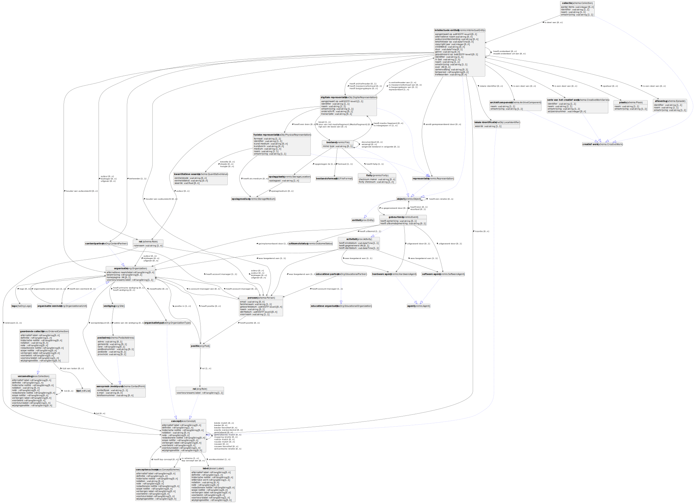

# Knowledge Graph Metadatamodellen

Hier vind je alle informatie over de semantische datamodellen en thesauri in de meemoo Knowledge Graph.
Deze datamodellen en thesauri worden gebruikt om alle kennis uit het meemoo archief als metadata voor te stellen.
Voor het beschrijven van deze brede kennis hanteren we een modulair datamodel dat bestaat uit:

- een specifiek domeinmodel per relevant domein (bv. preserveren, digitaliseren, gebruiken) die de metadata die in dit domein ontstaan in de diepte beschrijven;
- een breed kernmodel met de algemene begrippen die in de domeinmodellen terugkomen;
- metamodellen om de opgebouwde kennis te annoteren zoals gebruiksrecht (wie mag er wat met de metadata of het materiaal?) of dataherkomst (wie heeft metadata toegevoegd of gewijzigd en wanneer?).

De thesauri zijn gecontroleerde (hierarchische) termenlijsten om dingen te classificeren.
Alle datamodellen zijn beschrikbaar in [RDFS](https://www.w3.org/TR/rdf-schema/) en [SHACL](https://www.w3.org/TR/shacl/); de thesauri als [SKOS](https://www.w3.org/TR/skos-reference/).

{: .note }
Deze metadatamodellen zijn momenteel nog in ontwikkeling en zijn dus nog niet beschikbaar in productie.

## Datamodellen

<figure>
    

        

            
        

    

    <figcaption>Dit diagram geeft een overzicht van alle modellen samen.</figcaption>
</figure>

| **Objectstructuur (kernmodel)** | 0.0.1 | [Nederlands]({{ site.baseurl }}) | [Engels]({{ site.baseurl }})
| **Organisaties** | 0.0.1 | [Nederlands]({{ site.baseurl }}) | [Engels]({{ site.baseurl }})
| **Descriptie** | 0.0.1 | [Nederlands]({{ site.baseurl }}) | [Engels]({{ site.baseurl }})
| **Data herkomst** | 0.0.1 | [Nederlands]({{ site.baseurl }}) | [Engels]({{ site.baseurl }}) |

## Thesauri

| **Onderwijs: onderwijsstructuur** | 1.0.0 | [Nederlands](https://w3id.org/onderwijs-vlaanderen/id/structuur/) | _Nog niet beschikbaar_ |
| **Onderwijs: vakken** | 1.0.0 | [Nederlands](https://w3id.org/onderwijs-vlaanderen/id/vak/) | _Nog niet beschikbaar_ |
| **Onderwijs: themas** | 1.0.0 | _Nog niet beschikbaar_ | _Nog niet beschikbaar_ |
| **Organisatie: types** | 0.0.1 | _Nog niet beschikbaar_ | _Nog niet beschikbaar_ |
| **Organisatie: functies** | 0.0.1 | _Nog niet beschikbaar_ | _Nog niet beschikbaar_ |
| **Data herkomst: gebeurtenistypes** | 0.0.1 | _Nog niet beschikbaar_ | _Nog niet beschikbaar_ |

