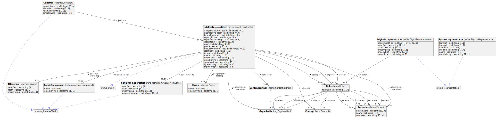

Datamodel Descriptie
====================

**Version:** 

**Prior version:** 

**Created:** 2022-03-23

**Last modified:** 2022-06-28

**Authors:**
[Miel Vander Sande](mailto:miel.vandersande@meemoo.be)
, [Lennert Van de Velde](mailto:lennert.vandevelde@meemoo.be)
, [Milan Valadou](mailto:milan.valadou@meemoo.be)

Datamodel voor de beschrijving van de inhoud van objecten.

## Namespaces

| Prefix | URI      |
| :----- | :------- |
| brick     | [https://brickschema.org/schema/Brick#](https://brickschema.org/schema/Brick#) |
| csvw     | [http://www.w3.org/ns/csvw#](http://www.w3.org/ns/csvw#) |
| dc     | [http://purl.org/dc/elements/1.1/](http://purl.org/dc/elements/1.1/) |
| dcat     | [http://www.w3.org/ns/dcat#](http://www.w3.org/ns/dcat#) |
| dcmitype     | [http://purl.org/dc/dcmitype/](http://purl.org/dc/dcmitype/) |
| dcterms     | [http://purl.org/dc/terms/](http://purl.org/dc/terms/) |
| dcam     | [http://purl.org/dc/dcam/](http://purl.org/dc/dcam/) |
| doap     | [http://usefulinc.com/ns/doap#](http://usefulinc.com/ns/doap#) |
| foaf     | [http://xmlns.com/foaf/0.1/](http://xmlns.com/foaf/0.1/) |
| odrl     | [http://www.w3.org/ns/odrl/2/](http://www.w3.org/ns/odrl/2/) |
| org     | [http://www.w3.org/ns/org#](http://www.w3.org/ns/org#) |
| owl     | [http://www.w3.org/2002/07/owl#](http://www.w3.org/2002/07/owl#) |
| prof     | [http://www.w3.org/ns/dx/prof/](http://www.w3.org/ns/dx/prof/) |
| prov     | [http://www.w3.org/ns/prov#](http://www.w3.org/ns/prov#) |
| qb     | [http://purl.org/linked-data/cube#](http://purl.org/linked-data/cube#) |
| rdf     | [http://www.w3.org/1999/02/22-rdf-syntax-ns#](http://www.w3.org/1999/02/22-rdf-syntax-ns#) |
| rdfs     | [http://www.w3.org/2000/01/rdf-schema#](http://www.w3.org/2000/01/rdf-schema#) |
| schema     | [https://schema.org/](https://schema.org/) |
| sh     | [http://www.w3.org/ns/shacl#](http://www.w3.org/ns/shacl#) |
| skos     | [http://www.w3.org/2004/02/skos/core#](http://www.w3.org/2004/02/skos/core#) |
| sosa     | [http://www.w3.org/ns/sosa/](http://www.w3.org/ns/sosa/) |
| ssn     | [http://www.w3.org/ns/ssn/](http://www.w3.org/ns/ssn/) |
| time     | [http://www.w3.org/2006/time#](http://www.w3.org/2006/time#) |
| vann     | [http://purl.org/vocab/vann/](http://purl.org/vocab/vann/) |
| void     | [http://rdfs.org/ns/void#](http://rdfs.org/ns/void#) |
| xsd     | [http://www.w3.org/2001/XMLSchema#](http://www.w3.org/2001/XMLSchema#) |
| xml     | [http://www.w3.org/XML/1998/namespace](http://www.w3.org/XML/1998/namespace) |
| dct     | [http://purl.org/dc/terms/](http://purl.org/dc/terms/) |
| ebucore     | [http://www.ebu.ch/metadata/ontologies/ebucore/ebucore#](http://www.ebu.ch/metadata/ontologies/ebucore/ebucore#) |
| edtf     | [http://id.loc.gov/datatypes/edtf/](http://id.loc.gov/datatypes/edtf/) |
| haDes     | [https://data.hetarchief.be/ns/description#](https://data.hetarchief.be/ns/description#) |
| haOrg     | [https://data.hetarchief.be/ns/organization#](https://data.hetarchief.be/ns/organization#) |
| haObj     | [https://data.hetarchief.be/ns/object#](https://data.hetarchief.be/ns/object#) |
| premis     | [http://www.loc.gov/premis/rdf/v3/](http://www.loc.gov/premis/rdf/v3/) |
| dc11     | [http://purl.org/dc/elements/1.1/](http://purl.org/dc/elements/1.1/) |
| edm     | [http://www.europeana.eu/schemas/edm/](http://www.europeana.eu/schemas/edm/) |
| ma     | [http://www.w3.org/ns/ma-ont#](http://www.w3.org/ns/ma-ont#) |
| rel     | [http://id.loc.gov/vocabulary/preservation/relationshipSubType/](http://id.loc.gov/vocabulary/preservation/relationshipSubType/) |
| seq     | [http://www.ontologydesignpatterns.org/cp/owl/sequence.owl#](http://www.ontologydesignpatterns.org/cp/owl/sequence.owl#) |
| xsd1     | [http://www.w3.org/2001/XMLSchema](http://www.w3.org/2001/XMLSchema) |

## Classes & properties

**Classes:** 
 [Intellectuele entiteit](#premis%3Aintellectualentity)
 |  [Fysieke representatie](#haobj%3Aphysicalrepresentation)
 |  [Digitale representatie](#haobj%3Adigitalrepresentation)
 |  [Serie van het creatief werk](#schema%3Acreativeworkseries)
 |  [Aflevering](#schema%3Aepisode)
 |  [Plaats](#schema%3Aplace)
 |  [Archiefcomponent](#schema%3Aarchivecomponent)
 |  [Rol](#schema%3Arole)
 |  [Persoon](#schema%3Aperson)
 |  [Concept](#skos%3Aconcept)
 |  [Organisatie](#org%3Aorganization)
 |  [Contentpartner](#haorg%3Acontentpartner)

## Intellectuele entiteit <small>[(premis:IntellectualEntity)](http://www.loc.gov/premis/rdf/v3/IntellectualEntity)</small>

**Subclass of:** 
[premis:Object](#premis%3Aobject)

Set van inhoud die beschouwd wordt als één enkele intellectuele eenheid met als doeleinden beheer en beschrijving.

| Property | Description | Cardinality | Datatype |
| :------ | :---------- | :---------- | :------- |
| aangemaakt op   <small>[(schema:dateCreated)](https://schema.org/dateCreated)</small> | De datum waarin het CreativeWork werd gemaakt. | `[0..1]` | [`edtf:EDTF-level1`](http://id.loc.gov/datatypes/edtf/EDTF-level1) |
| alternatieve naam   <small>[(schema:alternateName)](https://schema.org/alternateName)</small> | Een alias voor het item | `[0..n]` | [`xsd:string`](http://www.w3.org/2001/XMLSchema#string) |
| auteur   <small>[(schema:author)](https://schema.org/author)</small> | De auteur van deze inhoud of beoordeling. | `[0..n]` | [Rol](#schema%3Arole) |
| auteur van de copyright   <small>[(schema:copyrightHolder)](https://schema.org/copyrightHolder)</small> | De partij die de auteursrechten heeft op het CreativeWork. | `[0..n]` | [Persoon](#schema%3Aperson) _or_ [Organisatie](#org%3Aorganization) |
| beheerder   <small>[(schema:maintainer)](https://schema.org/maintainer)</small> | Een beheerder is een Persoon of Organisatie die bijdragen beheert aan, en/of publicatie van, een (meestal complex) artefact. | `[1..1]` | [Contentpartner](#haorg%3Acontentpartner) |
| beschikbaar op   <small>[(dcterms:available)](http://purl.org/dc/terms/available)</small> | Datum waarop de bron beschikbaar is of zal zijn . | `[0..n]` | [`xsd:dateTime`](http://www.w3.org/2001/XMLSchema#dateTime) |
| bijdrager   <small>[(schema:contributor)](https://schema.org/contributor)</small> | Een tweede bijdrager aan het CreativeWork of Event. | `[0..n]` | [Rol](#schema%3Arole) |
| copyright jaar   <small>[(schema:copyrightYear)](https://schema.org/copyrightYear)</small> | Het jaar waarin het auteursrecht voor het CreativeWork voor het eerst gold/geldend gemaakt werd. | `[0..n]` | [`xsd:integer`](http://www.w3.org/2001/XMLSchema#integer) |
| copyright melding   <small>[(schema:copyrightNotice)](https://schema.org/copyrightNotice)</small> | Tekst van een mededeling die geschikt is om de auteursrechtelijke aspecten van dit CreativeWork te beschrijven, idealiter met vermelding van de auteursrechthouder van het werk. | `[0..n]` | [`xsd:string`](http://www.w3.org/2001/XMLSchema#string) |
| credit tekst   <small>[(schema:creditText)](https://schema.org/creditText)</small> | Tekst die gebruikt kan worden om personen en/of organisaties aan te geven die met een gepubliceerd CreativeWork zijn verbonden. | `[0..n]` | [`xsd:string`](http://www.w3.org/2001/XMLSchema#string) |
| deel van aflevering   <small>[(schema:partOfEpisode)](https://schema.org/partOfEpisode)</small> | De aflevering waar deze clip toe behoort. | `[0..1]` | [Aflevering](#schema%3Aepisode) |
| deel van serie   <small>[(schema:partOfSeries)](https://schema.org/partOfSeries)</small> | De serie waar deze aflevering of seizoen toe behoort. | `[0..1]` | [Serie van het creatief werk](#schema%3Acreativeworkseries) |
| duur   <small>[(schema:duration)](https://schema.org/duration)</small> | De duur van het item (film, opname audio, evenement, enz.) in ISO 8601 datumformaat. | `[0..1]` | [`xsd:dateTime`](http://www.w3.org/2001/XMLSchema#dateTime) |
| genre   <small>[(schema:genre)](https://schema.org/genre)</small> | Genre van het CreativeWork, uitzendkanaal of groep. | `[0..n]` | [`xsd:string`](http://www.w3.org/2001/XMLSchema#string) |
| geografische dekking   <small>[(schema:spatialCoverage)](https://schema.org/spatialCoverage)</small> | De geografische dekking van een CreativeWork geeft aan waar de focus van de inhoud ligt. | `[0..n]` | [Plaats](#schema%3Aplace) |
| gepubliceerd op   <small>[(schema:datePublished)](https://schema.org/datePublished)</small> | De datum waarop de eerste uitzending/publicatie plaatsvond. | `[0..1]` | [`edtf:EDTF-level1`](http://id.loc.gov/datatypes/edtf/EDTF-level1) |
| identifier   <small>[(schema:identifier)](https://schema.org/identifier)</small> | De identifier-eigenschap representeert elk soort identifier voor elk soort ding (Thing), zoals ISBNs, GTIN codes, UUIDs enz. | `[1..1]` | [`xsd:string`](http://www.w3.org/2001/XMLSchema#string) |
| in taal   <small>[(schema:inLanguage)](https://schema.org/inLanguage)</small> | De taal van de inhoud of de uitvoering of gebruikt in een actie. Gebruik bij voorkeur één van de taalcodes uit de IETF BCP 47 standaard. | `[1..n]` | [`xsd:string`](http://www.w3.org/2001/XMLSchema#string) |
| is een deel van   <small>[(schema:isPartOf)](https://schema.org/isPartOf)</small> | Geeft een item of CreativeWork aan waarvan dit item, of CreativeWork (in een bepaald opzicht), een onderdeel is. | `[0..1]` | [Archiefcomponent](#schema%3Aarchivecomponent) |
| licentie   <small>[(schema:license)](https://schema.org/license)</small> | Een licentiedocument dat geldig is voor deze inhoud, meestal gekenmerkt door een URL. | `[0..n]` | [Concept](#skos%3Aconcept) |
| naam   <small>[(schema:name)](https://schema.org/name)</small> | De naam van het item. | `[1..1]` | [`xsd:string`](http://www.w3.org/2001/XMLSchema#string) |
| object type   <small>[(ebucore:objectType)](http://www.ebu.ch/metadata/ontologies/ebucore/ebucore#objectType)</small> |  | `[0..1]` | [`xsd:string`](http://www.w3.org/2001/XMLSchema#string) |
| omschrijving   <small>[(schema:description)](https://schema.org/description)</small> | Een beschrijving van het item. | `[1..1]` | [`xsd:string`](http://www.w3.org/2001/XMLSchema#string) |
| over   <small>[(schema:about)](https://schema.org/about)</small> | Het onderwerp van de inhoud. | `[0..n]` |  |
| samenvatting   <small>[(schema:abstract)](https://schema.org/abstract)</small> | Een abstract is een korte beschrijving die een CreativeWork samenvat. | `[0..1]` | [`xsd:string`](http://www.w3.org/2001/XMLSchema#string) |
| tijdsdekking   <small>[(schema:temporalCoverage)](https://schema.org/temporalCoverage)</small> | De dekking in de tijd van een CreativeWork geeft aan oveer welke periode inhoud handelt, bijvoorbeeld als een DateTime of als een tekstuele string die een tijdsinterval in ISO 8601 formaat aanduidt. | `[0..n]` | [`xsd:string`](http://www.w3.org/2001/XMLSchema#string) |
| trefwoorden   <small>[(schema:keywords)](https://schema.org/keywords)</small> | Trefwoorden of tags die gebruikt worden om een item te beschrijven. Meerdere tekstuele elementen in een trefwoordenlijst worden meestal gescheiden door komma's, of door het herhaling van de eigenschap (Property). | `[0..n]` | [`xsd:string`](http://www.w3.org/2001/XMLSchema#string) |
| uitgever   <small>[(schema:publisher)](https://schema.org/publisher)</small> | De uitgever van het kunstwerk. | `[0..n]` | [Rol](#schema%3Arole) |

## Fysieke representatie <small>[(haObj:PhysicalRepresentation)](https://data.hetarchief.be/ns/object#PhysicalRepresentation)</small>

**Subclass of:** 
[premis:Representation](#premis%3Arepresentation)

Fysieke representatie van een gearchiveerde intellectuele entiteit, zoals een analoge AV drager, een canvas, of een fysiek object zoals een beeldhouwwerk.

| Property | Description | Cardinality | Datatype |
| :------ | :---------- | :---------- | :------- |
| formaat   <small>[(dcterms:format)](http://purl.org/dc/terms/format)</small> | Het bestandsformaat, fysiek medium of afmetingen van de bron. | `[1..1]` | [`xsd:string`](http://www.w3.org/2001/XMLSchema#string) |
| formaat   <small>[(dcterms:format)](http://purl.org/dc/terms/format)</small> | Het bestandsformaat, het opslagmedium of de afmetingen van het bestand. | `[1..1]` | [`xsd:string`](http://www.w3.org/2001/XMLSchema#string) |
| identifier   <small>[(schema:identifier)](https://schema.org/identifier)</small> | De identifier-eigenschap representeert elk soort identifier voor elk soort ding (Thing), zoals ISBNs, GTIN codes, UUIDs enz. | `[1..1]` | [`xsd:string`](http://www.w3.org/2001/XMLSchema#string) |
| medium   <small>[(dcterms:medium)](http://purl.org/dc/terms/medium)</small> | Het materiaal of fysieke drager van de bron | `[1..n]` | [`xsd:string`](http://www.w3.org/2001/XMLSchema#string) |
| naam   <small>[(schema:name)](https://schema.org/name)</small> | De naam van het item. | `[1..1]` | [`xsd:string`](http://www.w3.org/2001/XMLSchema#string) |
| omschrijving   <small>[(schema:description)](https://schema.org/description)</small> | Een beschrijving van het item. | `[1..1]` | [`xsd:string`](http://www.w3.org/2001/XMLSchema#string) |

## Digitale representatie <small>[(haObj:DigitalRepresentation)](https://data.hetarchief.be/ns/object#DigitalRepresentation)</small>

**Subclass of:** 
[premis:Representation](#premis%3Arepresentation)

Digitale representatie van een gearchiveerde intellectuele entiteit, zoals een analoge AV drager, een canvas, of een fysiek object zoals een beeldhouwwerk.

| Property | Description | Cardinality | Datatype |
| :------ | :---------- | :---------- | :------- |
| aangemaakt op   <small>[(schema:dateCreated)](https://schema.org/dateCreated)</small> | De datum waarin het CreativeWork werd gemaakt. | `[1..1]` | [`edtf:EDTF-level1`](http://id.loc.gov/datatypes/edtf/EDTF-level1) |
| auteur   <small>[(schema:author)](https://schema.org/author)</small> | De auteur van deze inhoud of beoordeling. | `[0..n]` | [Rol](#schema%3Arole) |
| identifier   <small>[(schema:identifier)](https://schema.org/identifier)</small> | De identifier-eigenschap representeert elk soort identifier voor elk soort ding (Thing), zoals ISBNs, GTIN codes, UUIDs enz. | `[1..1]` | [`xsd:string`](http://www.w3.org/2001/XMLSchema#string) |
| naam   <small>[(schema:name)](https://schema.org/name)</small> | De naam van het item. | `[1..1]` | [`xsd:string`](http://www.w3.org/2001/XMLSchema#string) |
| omschrijving   <small>[(schema:description)](https://schema.org/description)</small> | Een beschrijving van het item. | `[1..1]` | [`xsd:string`](http://www.w3.org/2001/XMLSchema#string) |
| onderschrift   <small>[(schema:caption)](https://schema.org/caption)</small> | De ondertiteling voor dit object. | `[0..1]` | [`xsd:string`](http://www.w3.org/2001/XMLSchema#string) |
| transcriptie   <small>[(schema:transcript)](https://schema.org/transcript)</small> | Als dit MediaObject een AudioObject of VideoObject is, de transcriptie van dat object. | `[0..1]` | [`xsd:string`](http://www.w3.org/2001/XMLSchema#string) |

## Serie van het creatief werk <small>[(schema:CreativeWorkSeries)](https://schema.org/CreativeWorkSeries)</small>

**Subclass of:** 
[schema:CreativeWork](#schema%3Acreativework)

Een CreativeWorkSeries in schema.org is een groep vergelijkbare items, meestal maar niet altijd van dezelfde soort. CreativeWorkSeries zijn meestal gegroepeerd in een bepaalde volgorde, vaak chronologisch. In tegenstelling tot ItemList, ligt de nadruk van CreativeWorkSeries op gepubliceerd materiaal (bijvoorbeeld boeken en periodieken, of media zoals tv, radio en games).

| Property | Description | Cardinality | Datatype |
| :------ | :---------- | :---------- | :------- |
| identifier   <small>[(schema:identifier)](https://schema.org/identifier)</small> | De identifier-eigenschap representeert elk soort identifier voor elk soort ding (Thing), zoals ISBNs, GTIN codes, UUIDs enz. | `[1..1]` | [`xsd:string`](http://www.w3.org/2001/XMLSchema#string) |
| naam   <small>[(schema:name)](https://schema.org/name)</small> | De naam van het item. | `[1..1]` | [`xsd:string`](http://www.w3.org/2001/XMLSchema#string) |
| omschrijving   <small>[(schema:description)](https://schema.org/description)</small> | Een beschrijving van het item. | `[1..1]` | [`xsd:string`](http://www.w3.org/2001/XMLSchema#string) |
| seizoensnummer   <small>[(schema:seasonNumber)](https://schema.org/seasonNumber)</small> | Positie van het seizoen in een geordende groep van seizoenen. | `[0..n]` | [`xsd:integer`](http://www.w3.org/2001/XMLSchema#integer) |

## Aflevering <small>[(schema:Episode)](https://schema.org/Episode)</small>

**Subclass of:** 
[schema:CreativeWork](#schema%3Acreativework)

Een media aflevering (bijvoorbeeld tv, radio, videogame) die deel uitmaakt van een serie of seizoen.

| Property | Description | Cardinality | Datatype |
| :------ | :---------- | :---------- | :------- |
| identifier   <small>[(schema:identifier)](https://schema.org/identifier)</small> | De identifier-eigenschap representeert elk soort identifier voor elk soort ding (Thing), zoals ISBNs, GTIN codes, UUIDs enz. | `[1..1]` | [`xsd:string`](http://www.w3.org/2001/XMLSchema#string) |
| naam   <small>[(schema:name)](https://schema.org/name)</small> | De naam van het item. | `[1..1]` | [`xsd:string`](http://www.w3.org/2001/XMLSchema#string) |
| omschrijving   <small>[(schema:description)](https://schema.org/description)</small> | Een beschrijving van het item. | `[1..1]` | [`xsd:string`](http://www.w3.org/2001/XMLSchema#string) |

## Plaats <small>[(schema:Place)](https://schema.org/Place)</small>

Entiteiten die een enigszins vastliggende, fysieke uitbreiding hebben.

| Property | Description | Cardinality | Datatype |
| :------ | :---------- | :---------- | :------- |
| naam   <small>[(schema:name)](https://schema.org/name)</small> | De naam van het item. | `[1..1]` | [`xsd:string`](http://www.w3.org/2001/XMLSchema#string) |
| omschrijving   <small>[(schema:description)](https://schema.org/description)</small> | Een beschrijving van het item. | `[1..1]` | [`xsd:string`](http://www.w3.org/2001/XMLSchema#string) |

## Archiefcomponent <small>[(schema:ArchiveComponent)](https://schema.org/ArchiveComponent)</small>

**Subclass of:** 
[schema:CreativeWork](#schema%3Acreativework)

Een immaterieel type dat toegepast moet worden op elke inhoud van het archief, met daarbij een set van eigenschappen die nodig zijn om archiefitems en -collecties te beschrijven.

| Property | Description | Cardinality | Datatype |
| :------ | :---------- | :---------- | :------- |
| naam   <small>[(schema:name)](https://schema.org/name)</small> | De naam van het item. | `[1..1]` | [`xsd:string`](http://www.w3.org/2001/XMLSchema#string) |
| omschrijving   <small>[(schema:description)](https://schema.org/description)</small> | Een beschrijving van het item. | `[1..1]` | [`xsd:string`](http://www.w3.org/2001/XMLSchema#string) |

## Rol <small>[(schema:Role)](https://schema.org/Role)</small>

**Subclasses:** 
[schema:PerformanceRole](#schema%3Aperformancerole)

Stelt bijkomende informatie voor over een relatie of eigenschap.
        Bijvoorbeeld: een rol kan worden gebruikt om aan te geven dat een 'lid'rol (member role) die een sportteam aan een speler verbond, tijdens een bepaalde periode voorviel.
        Of dat een persoons 'acteur'rol (actor role) in een film voor een bepaalde karakternaam was.
        Deze eigenschappen kunnen worden toegevoegd aan een rolentiteit, die dan geassocieerd wordt met de hoofdentiteiten via normale eigenschappen zoals 'lid' (member) of 'acteur' (actor).
        

| Property | Description | Cardinality | Datatype |
| :------ | :---------- | :---------- | :------- |
| acteur   <small>[(schema:actor)](https://schema.org/actor)</small> | Een acteur, bv. in tv, radio, film, videogames etc. of in een evenement. Acteurs kunnen geassocieerd worden met met individuele items of met een serie, aflevering, clip. | `[0..n]` | [Persoon](#schema%3Aperson) |
| auteur   <small>[(schema:author)](https://schema.org/author)</small> | De auteur van deze inhoud of beoordeling. | `[0..n]` | [Persoon](#schema%3Aperson) _or_ [Organisatie](#org%3Aorganization) |
| bijdrager   <small>[(schema:contributor)](https://schema.org/contributor)</small> | Een tweede bijdrager aan het CreativeWork of Event. | `[0..n]` | [Persoon](#schema%3Aperson) _or_ [Organisatie](#org%3Aorganization) |
| rolenaam   <small>[(schema:roleName)](https://schema.org/roleName)</small> | Een rol gespeeld of vertolkt door een persoon of organisatie. | `[1..n]` | [`xsd:string`](http://www.w3.org/2001/XMLSchema#string) _or_ [Concept](#skos%3Aconcept) |
| uitgever   <small>[(schema:publisher)](https://schema.org/publisher)</small> | De uitgever van het kunstwerk. | `[0..n]` | [Persoon](#schema%3Aperson) _or_ [Organisatie](#org%3Aorganization) |

## Persoon <small>[(schema:Person)](https://schema.org/Person)</small>

Een persoon (levend, dood, ondood, of fictief).

| Property | Description | Cardinality | Datatype |
| :------ | :---------- | :---------- | :------- |
| achternaam   <small>[(schema:familyName)](https://schema.org/familyName)</small> | Familienaam. In de V.S., de achternaam van een Persoon. | `[0..n]` | [`xsd:string`](http://www.w3.org/2001/XMLSchema#string) |
| naam   <small>[(schema:name)](https://schema.org/name)</small> | De naam van het item. | `[1..1]` | [`xsd:string`](http://www.w3.org/2001/XMLSchema#string) |
| voornaam   <small>[(schema:givenName)](https://schema.org/givenName)</small> | Voornaam. In de V.S., de eerste naam van een Persoon. | `[0..n]` | [`xsd:string`](http://www.w3.org/2001/XMLSchema#string) |

## Concept <small>[(skos:Concept)](http://www.w3.org/2004/02/skos/core#Concept)</small>

**Subclasses:** 
[haObj:LocalIdentifier](#haobj%3Alocalidentifier)
, [haOrg:OrganizationType](#haorg%3Aorganizationtype)
, [org:Role](#org%3Arole)

Een SKOS-concept kan als idee of begrip worden gezien; een gedachte-eenheid. Echter, wat  een gedachte-eenheid is, is subjectief, en deze definitie is eerder suggestief dan beperkend bedoeld.

## Organisatie <small>[(org:Organization)](http://www.w3.org/ns/org#Organization)</small>

**Subclasses:** 
[haOrg:ContentPartner](#haorg%3Acontentpartner)
, [haOrg:ServiceConsumer](#haorg%3Aserviceconsumer)
, [haOrg:ServiceProvider](#haorg%3Aserviceprovider)
, [haOrg:EducationalOrganization](#haorg%3Aeducationalorganization)
, [org:OrganizationalUnit](#org%3Aorganizationalunit)

Stelt een groep personen voor, georganiseerd in een gemeenschap of een andere sociale, commerciële of politieke structuur. De groep heeft een gemeenschappelijk doel of reden van bestaan dat verder gaat dan de som van de mensen die ertoe behoren en kan handelen als `Agent`. De organisaties zijn vaak onder te verdelen in hiërarchische structuren. Het wordt aanbevolen om SKOS labels te gebruiken om de organisatie te benoemen. In het bijzonder `skos:prefLabel` voor de primaire (mogelijks juridisch geldende) naam, `skos:altLabel` voor alternatieve namen (handelsnamen, colloquialismen) en `skos:notation` om een code aan te duiden uit een codelijst.

## Contentpartner <small>[(haOrg:ContentPartner)](https://data.hetarchief.be/ns/organization#ContentPartner)</small>

**Subclass of:** 
[org:Organization](#org%3Aorganization)

Een contentpartner is een organisatie dat een samenwerkingovereenkomst heeft ondertekend met meemoo voor de lange-termijn preservatie en ontsluiting van hun materiaal.

