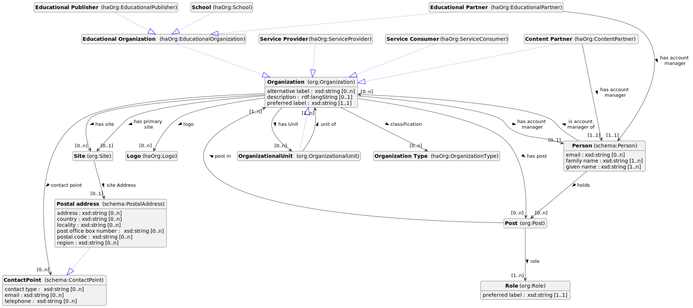

Datamodel Organisaties
====================

**Version:** 

**Prior version:** 

**Created:** 2022-03-14

**Last modified:** 2022-06-16

**Authors:**
[Miel Vander Sande](mailto:miel.vandersande@meemoo.be)
, [Milan Valadou](mailto:milan.valadou@meemoo.be)

Datamodel voor het beschrijven van organisaties.

## Namespaces

| Prefix | URI      |
| :----- | :------- |
| brick     | [https://brickschema.org/schema/Brick#](https://brickschema.org/schema/Brick#) |
| csvw     | [http://www.w3.org/ns/csvw#](http://www.w3.org/ns/csvw#) |
| dc     | [http://purl.org/dc/elements/1.1/](http://purl.org/dc/elements/1.1/) |
| dcat     | [http://www.w3.org/ns/dcat#](http://www.w3.org/ns/dcat#) |
| dcmitype     | [http://purl.org/dc/dcmitype/](http://purl.org/dc/dcmitype/) |
| dcterms     | [http://purl.org/dc/terms/](http://purl.org/dc/terms/) |
| dcam     | [http://purl.org/dc/dcam/](http://purl.org/dc/dcam/) |
| doap     | [http://usefulinc.com/ns/doap#](http://usefulinc.com/ns/doap#) |
| foaf     | [http://xmlns.com/foaf/0.1/](http://xmlns.com/foaf/0.1/) |
| odrl     | [http://www.w3.org/ns/odrl/2/](http://www.w3.org/ns/odrl/2/) |
| org     | [http://www.w3.org/ns/org#](http://www.w3.org/ns/org#) |
| owl     | [http://www.w3.org/2002/07/owl#](http://www.w3.org/2002/07/owl#) |
| prof     | [http://www.w3.org/ns/dx/prof/](http://www.w3.org/ns/dx/prof/) |
| prov     | [http://www.w3.org/ns/prov#](http://www.w3.org/ns/prov#) |
| qb     | [http://purl.org/linked-data/cube#](http://purl.org/linked-data/cube#) |
| rdf     | [http://www.w3.org/1999/02/22-rdf-syntax-ns#](http://www.w3.org/1999/02/22-rdf-syntax-ns#) |
| rdfs     | [http://www.w3.org/2000/01/rdf-schema#](http://www.w3.org/2000/01/rdf-schema#) |
| schema     | [https://schema.org/](https://schema.org/) |
| sh     | [http://www.w3.org/ns/shacl#](http://www.w3.org/ns/shacl#) |
| skos     | [http://www.w3.org/2004/02/skos/core#](http://www.w3.org/2004/02/skos/core#) |
| sosa     | [http://www.w3.org/ns/sosa/](http://www.w3.org/ns/sosa/) |
| ssn     | [http://www.w3.org/ns/ssn/](http://www.w3.org/ns/ssn/) |
| time     | [http://www.w3.org/2006/time#](http://www.w3.org/2006/time#) |
| vann     | [http://purl.org/vocab/vann/](http://purl.org/vocab/vann/) |
| void     | [http://rdfs.org/ns/void#](http://rdfs.org/ns/void#) |
| xsd     | [http://www.w3.org/2001/XMLSchema#](http://www.w3.org/2001/XMLSchema#) |
| xml     | [http://www.w3.org/XML/1998/namespace](http://www.w3.org/XML/1998/namespace) |
| dct     | [http://purl.org/dc/terms/](http://purl.org/dc/terms/) |
| haOrg     | [https://data.hetarchief.be/ns/organization#](https://data.hetarchief.be/ns/organization#) |

## Classes & properties

**Classes:** 
 [Organisatie](#org%3Aorganization)
 |  [Organisatie-eenheid](#org%3Aorganizationalunit)
 |  [Contentpartner](#haorg%3Acontentpartner)
 |  [Dienstenleverancier](#haorg%3Aserviceprovider)
 |  [Dienstenafnemer](#haorg%3Aserviceconsumer)
 |  [Educatieve organisatie](#haorg%3Aeducationalorganization)
 |  [Educatieve partner](#haorg%3Aeducationalpartner)
 |  [Educatieve uitgeverij](#haorg%3Aeducationalpublisher)
 |  [School](#haorg%3Aschool)
 |  [Vestiging](#org%3Asite)
 |  [Positie](#org%3Apost)
 |  [Rol](#org%3Arole)
 |  [Persoon](#schema%3Aperson)
 |  [Postadres](#schema%3Apostaladdress)
 |  [Aanspreek-/meldpunt](#schema%3Acontactpoint)
 |  [Logo](#haorg%3Alogo)
 |  [Organisatietype](#haorg%3Aorganizationtype)

## Organisatie <small>[(org:Organization)](http://www.w3.org/ns/org#Organization)</small>

**Subclasses:** 
[haOrg:ContentPartner](#haorg%3Acontentpartner)
, [haOrg:ServiceConsumer](#haorg%3Aserviceconsumer)
, [haOrg:ServiceProvider](#haorg%3Aserviceprovider)
, [haOrg:EducationalOrganization](#haorg%3Aeducationalorganization)
, [org:OrganizationalUnit](#org%3Aorganizationalunit)

Stelt een groep personen voor, georganiseerd in een gemeenschap of een andere sociale, commerciële of politieke structuur. De groep heeft een gemeenschappelijk doel of reden van bestaan dat verder gaat dan de som van de mensen die ertoe behoren en kan handelen als `Agent`. De organisaties zijn vaak onder te verdelen in hiërarchische structuren. Het wordt aanbevolen om SKOS labels te gebruiken om de organisatie te benoemen. In het bijzonder `skos:prefLabel` voor de primaire (mogelijks juridisch geldende) naam, `skos:altLabel` voor alternatieve namen (handelsnamen, colloquialismen) en `skos:notation` om een code aan te duiden uit een codelijst.

| Property | Description | Cardinality | Datatype |
| :------ | :---------- | :---------- | :------- |
| aanspreekpunt   <small>[(schema:contactPoint)](https://schema.org/contactPoint)</small> | Een Organisatie kan een aanspreekpunt hebben. | `[0..n]` | [Aanspreek-/meldpunt](#schema%3Acontactpoint) |
| alternatieve naam/label   <small>[(skos:altLabel)](http://www.w3.org/2004/02/skos/core#altLabel)</small> | Het alternatieve label van het concept. | `[0..n]` | [`xsd:string`](http://www.w3.org/2001/XMLSchema#string) |
| beschrijving   <small>[(dct:description)](http://purl.org/dc/terms/description)</small> | Beschrijving van de organisatie. | `[0..1]` |  |
| classificatie   <small>[(org:classification)](http://www.w3.org/ns/org#classification)</small> | Het type waartoe de organisatie behoort. | `[0..n]` | [Organisatietype](#haorg%3Aorganizationtype) |
| heeft account manager   <small>[(haOrg:hasAccountmanager)](https://data.hetarchief.be/ns/organization#hasAccountmanager)</small> | De persoon binnen een organisatie die verantwoordelijk is voor het contact met een andere organisatie, bv. een klant. | `[0..1]` | [Persoon](#schema%3Aperson) |
| heeft een eenheid   <small>[(org:hasUnit)](http://www.w3.org/ns/org#hasUnit)</small> | Een aparte eenheid of afdeling van de organisatie. | `[0..n]` | [Organisatie-eenheid](#org%3Aorganizationalunit) |
| heeft positie   <small>[(org:hasPost)](http://www.w3.org/ns/org#hasPost)</small> | Verwijst naar een positie binnen de organisatie. | `[0..n]` | [Positie](#org%3Apost) |
| heeft primaire vestiging   <small>[(org:hasPrimarySite)](http://www.w3.org/ns/org#hasPrimarySite)</small> | De primaire vestiging van de organisatie. | `[0..1]` | [Vestiging](#org%3Asite) |
| heeft vestiging   <small>[(org:hasSite)](http://www.w3.org/ns/org#hasSite)</small> | Een fysieke of virtuele vestiging van de organisatie. | `[0..n]` | [Vestiging](#org%3Asite) |
| homepagina   <small>[(foaf:homepage)](http://xmlns.com/foaf/0.1/homepage)</small> | De website van de organisatie. | `[0..1]` |  |
| logo   <small>[(haOrg:hasLogo)](https://data.hetarchief.be/ns/organization#hasLogo)</small> | Een logo dat geassocieerd is met de organisatie. | `[1..n]` | [Logo](#haorg%3Alogo) |
| voorkeursnaam/-label   <small>[(skos:prefLabel)](http://www.w3.org/2004/02/skos/core#prefLabel)</small> | De voorkeursnaam/-label van het concept. | `[1..1]` | [`xsd:string`](http://www.w3.org/2001/XMLSchema#string) |

## Organisatie-eenheid <small>[(org:OrganizationalUnit)](http://www.w3.org/ns/org#OrganizationalUnit)</small>

**Subclass of:** 
[org:Organization](#org%3Aorganization)

Een organisatie zoals een afdeling of dienst die deel uitmaakt van de grotere organisatie en zijn bestaansreden daaraan ontleent. Heeft geen juridische status op zich.

| Property | Description | Cardinality | Datatype |
| :------ | :---------- | :---------- | :------- |
| organisatie-eenheid van   <small>[(org:unitOf)](http://www.w3.org/ns/org#unitOf)</small> | De organisatie waarvan de organisatie-eenheid deel uitmaakt. | `[1..n]` | [Organisatie](#org%3Aorganization) |

_Properties from [Organisatie](#org%3Aorganization):_  [aanspreekpunt](#schema%3Acontactpoint),  [alternatieve naam/label](#skos%3Aaltlabel),  [beschrijving](#dct%3Adescription),  [classificatie](#org%3Aclassification),  [heeft account manager](#haorg%3Ahasaccountmanager),  [heeft een eenheid](#org%3Ahasunit),  [heeft positie](#org%3Ahaspost),  [heeft primaire vestiging](#org%3Ahasprimarysite),  [heeft vestiging](#org%3Ahassite),  [homepagina](#foaf%3Ahomepage),  [logo](#haorg%3Ahaslogo),  [voorkeursnaam/-label](#skos%3Apreflabel)
## Contentpartner <small>[(haOrg:ContentPartner)](https://data.hetarchief.be/ns/organization#ContentPartner)</small>

**Subclass of:** 
[org:Organization](#org%3Aorganization)

Een contentpartner is een organisatie dat een samenwerkingovereenkomst heeft ondertekend met meemoo voor de lange-termijn preservatie en ontsluiting van hun materiaal.

| Property | Description | Cardinality | Datatype |
| :------ | :---------- | :---------- | :------- |
| heeft account manager   <small>[(haOrg:hasAccountManager)](https://data.hetarchief.be/ns/organization#hasAccountManager)</small> | De account manager van de organisatie. | `[1..1]` | [Persoon](#schema%3Aperson) |

_Properties from [Organisatie](#org%3Aorganization):_  [aanspreekpunt](#schema%3Acontactpoint),  [alternatieve naam/label](#skos%3Aaltlabel),  [beschrijving](#dct%3Adescription),  [classificatie](#org%3Aclassification),  [heeft account manager](#haorg%3Ahasaccountmanager),  [heeft een eenheid](#org%3Ahasunit),  [heeft positie](#org%3Ahaspost),  [heeft primaire vestiging](#org%3Ahasprimarysite),  [heeft vestiging](#org%3Ahassite),  [homepagina](#foaf%3Ahomepage),  [logo](#haorg%3Ahaslogo),  [voorkeursnaam/-label](#skos%3Apreflabel)
## Dienstenleverancier <small>[(haOrg:ServiceProvider)](https://data.hetarchief.be/ns/organization#ServiceProvider)</small>

**Subclass of:** 
[org:Organization](#org%3Aorganization)

Een organisatie die aan meemoo diensten of goederen levert: kan zowel gaan over IT, digitalisering, ...

_Properties from [Organisatie](#org%3Aorganization):_  [aanspreekpunt](#schema%3Acontactpoint),  [alternatieve naam/label](#skos%3Aaltlabel),  [beschrijving](#dct%3Adescription),  [classificatie](#org%3Aclassification),  [heeft account manager](#haorg%3Ahasaccountmanager),  [heeft een eenheid](#org%3Ahasunit),  [heeft positie](#org%3Ahaspost),  [heeft primaire vestiging](#org%3Ahasprimarysite),  [heeft vestiging](#org%3Ahassite),  [homepagina](#foaf%3Ahomepage),  [logo](#haorg%3Ahaslogo),  [voorkeursnaam/-label](#skos%3Apreflabel)
## Dienstenafnemer <small>[(haOrg:ServiceConsumer)](https://data.hetarchief.be/ns/organization#ServiceConsumer)</small>

**Subclass of:** 
[org:Organization](#org%3Aorganization)

Een organisatie die diensten bij meemoo afneemt, met contractuele relatie met meemoo. Het gaat hier niet over een contentpartner, maar ever een private organisatie die digitale opslag doet bij meemoo (bv. Plantentuin Meise).

_Properties from [Organisatie](#org%3Aorganization):_  [aanspreekpunt](#schema%3Acontactpoint),  [alternatieve naam/label](#skos%3Aaltlabel),  [beschrijving](#dct%3Adescription),  [classificatie](#org%3Aclassification),  [heeft account manager](#haorg%3Ahasaccountmanager),  [heeft een eenheid](#org%3Ahasunit),  [heeft positie](#org%3Ahaspost),  [heeft primaire vestiging](#org%3Ahasprimarysite),  [heeft vestiging](#org%3Ahassite),  [homepagina](#foaf%3Ahomepage),  [logo](#haorg%3Ahaslogo),  [voorkeursnaam/-label](#skos%3Apreflabel)
## Educatieve organisatie <small>[(haOrg:EducationalOrganization)](https://data.hetarchief.be/ns/organization#EducationalOrganization)</small>

**Subclass of:** 
[org:Organization](#org%3Aorganization)

**Subclasses:** 
[haOrg:EducationalPartner](#haorg%3Aeducationalpartner)
, [haOrg:EducationalPublisher](#haorg%3Aeducationalpublisher)
, [haOrg:School](#haorg%3Aschool)

Een educatieve organisatie is een organisatie of een bedrijf dat educatie en opleiding aanbiedt buiten een schoolcontext.

_Properties from [Organisatie](#org%3Aorganization):_  [aanspreekpunt](#schema%3Acontactpoint),  [alternatieve naam/label](#skos%3Aaltlabel),  [beschrijving](#dct%3Adescription),  [classificatie](#org%3Aclassification),  [heeft account manager](#haorg%3Ahasaccountmanager),  [heeft een eenheid](#org%3Ahasunit),  [heeft positie](#org%3Ahaspost),  [heeft primaire vestiging](#org%3Ahasprimarysite),  [heeft vestiging](#org%3Ahassite),  [homepagina](#foaf%3Ahomepage),  [logo](#haorg%3Ahaslogo),  [voorkeursnaam/-label](#skos%3Apreflabel)
## Educatieve partner <small>[(haOrg:EducationalPartner)](https://data.hetarchief.be/ns/organization#EducationalPartner)</small>

**Subclass of:** 
[haOrg:EducationalOrganization](#haorg%3Aeducationalorganization)

Een educatieve partner is een organisatie die content aanbiedt op het Archief voor Onderwijs platform en de samenwerkingsovereenkomst educatieve partner heeft ondertekend (vb educatieve uitgeverij, KlasCement, Mediawijs, ed.).

| Property | Description | Cardinality | Datatype |
| :------ | :---------- | :---------- | :------- |
| heeft account manager   <small>[(haOrg:hasAccountManager)](https://data.hetarchief.be/ns/organization#hasAccountManager)</small> | De account manager van de organisatie. | `[1..1]` | [Persoon](#schema%3Aperson) |

## Educatieve uitgeverij <small>[(haOrg:EducationalPublisher)](https://data.hetarchief.be/ns/organization#EducationalPublisher)</small>

**Subclass of:** 
[haOrg:EducationalOrganization](#haorg%3Aeducationalorganization)

Een educatieve uitgeverij is een bedrijf die educatieve content publiceert.

## School <small>[(haOrg:School)](https://data.hetarchief.be/ns/organization#School)</small>

**Subclass of:** 
[haOrg:EducationalOrganization](#haorg%3Aeducationalorganization)

Een door de Vlaamse overheid erkende onderwijsinstelling in het basis, secundair or hoger onderwijs.

## Vestiging <small>[(org:Site)](http://www.w3.org/ns/org#Site)</small>

Een kantoor of ander pand waar een organisatie gevestigd is. Organisaties kunnen over meerdere vestigingen verspreid zijn en vestigingen kunnen op meerdere locaties slaan.

| Property | Description | Cardinality | Datatype |
| :------ | :---------- | :---------- | :------- |
| adres van de vestiging   <small>[(org:siteAddress)](http://www.w3.org/ns/org#siteAddress)</small> | Het adres van de vestiging. | `[0..1]` | [Postadres](#schema%3Apostaladdress) |

## Positie <small>[(org:Post)](http://www.w3.org/ns/org#Post)</small>

Functie binnen een organisatie, kan bestaan los vd persoon of personen die ze invult.

| Property | Description | Cardinality | Datatype |
| :------ | :---------- | :---------- | :------- |
| positie in   <small>[(org:postIn)](http://www.w3.org/ns/org#postIn)</small> | Duidt de Organisatie aan waarbinnen de positie bestaat. | `[1..n]` | [Organisatie](#org%3Aorganization) |
| rol   <small>[(org:role)](http://www.w3.org/ns/org#role)</small> | Rol die de agent vervult als lid van de organisatie. | `[1..n]` | [Rol](#org%3Arole) |

## Rol <small>[(org:Role)](http://www.w3.org/ns/org#Role)</small>

Rol die een persoon of agent kan vervullen in een organisatie.

| Property | Description | Cardinality | Datatype |
| :------ | :---------- | :---------- | :------- |
| voorkeursnaam/-label   <small>[(skos:prefLabel)](http://www.w3.org/2004/02/skos/core#prefLabel)</small> | De voorkeursnaam/-label van het concept. | `[1..1]` | [`xsd:string`](http://www.w3.org/2001/XMLSchema#string) |

## Persoon <small>[(schema:Person)](https://schema.org/Person)</small>

Een persoon (levend, dood, ondood, of fictief).

| Property | Description | Cardinality | Datatype |
| :------ | :---------- | :---------- | :------- |
| email   <small>[(schema:email)](https://schema.org/email)</small> |  | `[0..n]` | [`xsd:string`](http://www.w3.org/2001/XMLSchema#string) |
| familienaam   <small>[(schema:familyName)](https://schema.org/familyName)</small> | De achternaam van een persoon. | `[1..n]` | [`xsd:string`](http://www.w3.org/2001/XMLSchema#string) |
| heeft positie   <small>[(org:holds)](http://www.w3.org/ns/org#holds)</small> | De positie die de persoon binnen de organisatie bekleedt. | `[0..n]` | [Positie](#org%3Apost) |
| is account manager van   <small>[(haOrg:isAccountManagerOf)](https://data.hetarchief.be/ns/organization#isAccountManagerOf)</small> | De organisatie waarvoor de persoon verantwoordelijk is. | `[0..n]` | [Organisatie](#org%3Aorganization) |
| voornaam   <small>[(schema:givenName)](https://schema.org/givenName)</small> | De voornaam van een persoon. | `[1..n]` | [`xsd:string`](http://www.w3.org/2001/XMLSchema#string) |

## Postadres <small>[(schema:PostalAddress)](https://schema.org/PostalAddress)</small>

**Subclass of:** 
[schema:ContactPoint](#schema%3Acontactpoint)

Het postadres.

| Property | Description | Cardinality | Datatype |
| :------ | :---------- | :---------- | :------- |
| adres   <small>[(schema:streetAddress)](https://schema.org/streetAddress)</small> | Het straatadres. Bijvoorbeeld, Kerkstraat 16. | `[0..n]` | [`xsd:string`](http://www.w3.org/2001/XMLSchema#string) |
| gemeente   <small>[(schema:addressLocality)](https://schema.org/addressLocality)</small> | De stad waarin het straatadres zich bevindt, en deel uitmaakt van de regio. Bijvoorbeeld, Brussel, Oostende, .... | `[0..n]` | [`xsd:string`](http://www.w3.org/2001/XMLSchema#string) |
| land   <small>[(schema:addressCountry)](https://schema.org/addressCountry)</small> | Het land waarin het postadres zich bevindt. | `[0..n]` | [`xsd:string`](http://www.w3.org/2001/XMLSchema#string) |
| postbusnummer   <small>[(schema:postOfficeBoxNumber)](https://schema.org/postOfficeBoxNumber)</small> | Het postbusnummer voor postbusadressen. | `[0..n]` | [`xsd:string`](http://www.w3.org/2001/XMLSchema#string) |
| postcode   <small>[(schema:postalCode)](https://schema.org/postalCode)</small> | De postcode. Bijvoorbeeld, 9400. | `[0..n]` | [`xsd:string`](http://www.w3.org/2001/XMLSchema#string) |
| provincie   <small>[(schema:addressRegion)](https://schema.org/addressRegion)</small> | De provincie van het land waarin de stad zich bevindt. Bijvoorbeeld, Oost-Vlaanderen, Limburg, etc. | `[0..n]` | [`xsd:string`](http://www.w3.org/2001/XMLSchema#string) |

_Properties from [Aanspreek-/meldpunt](#schema%3Acontactpoint):_  [contacttype](#schema%3Acontacttype),  [e-mail](#schema%3Aemail),  [telefoonnummer](#schema%3Atelephone)
## Aanspreek-/meldpunt <small>[(schema:ContactPoint)](https://schema.org/ContactPoint)</small>

**Subclasses:** 
[schema:PostalAddress](#schema%3Apostaladdress)

Een aanspreekpunt&#x2014;bijvoorbeeld, een afdeling voor klachten van klanten.

| Property | Description | Cardinality | Datatype |
| :------ | :---------- | :---------- | :------- |
| contacttype   <small>[(schema:contactType)](https://schema.org/contactType)</small> | Het type contactpunt. | `[0..n]` | [`xsd:string`](http://www.w3.org/2001/XMLSchema#string) |
| e-mail   <small>[(schema:email)](https://schema.org/email)</small> | Het e-mail adres. | `[0..n]` | [`xsd:string`](http://www.w3.org/2001/XMLSchema#string) |
| telefoonnummer   <small>[(schema:telephone)](https://schema.org/telephone)</small> | Het telefoonnummer. | `[0..n]` | [`xsd:string`](http://www.w3.org/2001/XMLSchema#string) |

## Logo <small>[(haOrg:Logo)](https://data.hetarchief.be/ns/organization#Logo)</small>

Een logo is een grafisch embleem of symbool van een organisatie.

## Organisatietype <small>[(haOrg:OrganizationType)](https://data.hetarchief.be/ns/organization#OrganizationType)</small>

Het type of classificatie van een organisatie.

